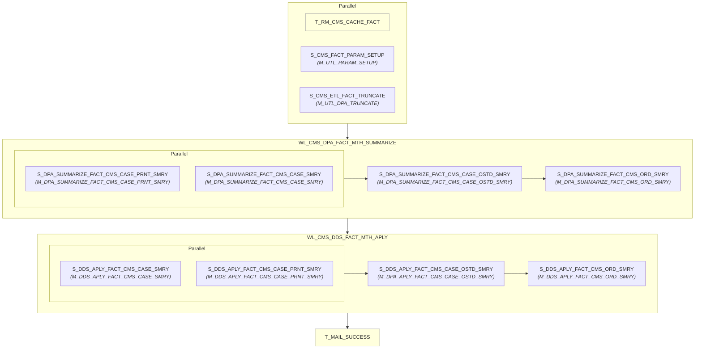

# WF_CMS_DDS_APLY_MTH

## Execution Flow

Auto-generated from Informatica PowerCenter workflow

## Session to Mapping

| Session | Mapping | Plan-Level |
|---------|---------|------------|
| T_RM_CMS_CACHE_FACT | - | Top-Level |
| S_CMS_FACT_PARAM_SETUP | M_UTL_PARAM_SETUP | Top-Level |
| S_CMS_ETL_FACT_TRUNCATE | M_UTL_DPA_TRUNCATE | Top-Level |
| S_DPA_SUMMARIZE_FACT_CMS_CASE_PRNT_SMRY | M_DPA_SUMMARIZE_FACT_CMS_CASE_PRNT_SMRY | Worklet: WL_CMS_DPA_FACT_MTH_SUMMARIZE |
| S_DPA_SUMMARIZE_FACT_CMS_CASE_SMRY | M_DPA_SUMMARIZE_FACT_CMS_CASE_SMRY | Worklet: WL_CMS_DPA_FACT_MTH_SUMMARIZE |
| S_DPA_SUMMARIZE_FACT_CMS_CASE_OSTD_SMRY | M_DPA_SUMMARIZE_FACT_CMS_CASE_OSTD_SMRY | Worklet: WL_CMS_DPA_FACT_MTH_SUMMARIZE |
| S_DPA_SUMMARIZE_FACT_CMS_ORD_SMRY | M_DPA_SUMMARIZE_FACT_CMS_ORD_SMRY | Worklet: WL_CMS_DPA_FACT_MTH_SUMMARIZE |
| S_DDS_APLY_FACT_CMS_CASE_SMRY | M_DDS_APLY_FACT_CMS_CASE_SMRY | Worklet: WL_CMS_DDS_FACT_MTH_APLY |
| S_DDS_APLY_FACT_CMS_CASE_PRNT_SMRY | M_DDS_APLY_FACT_CMS_CASE_PRNT_SMRY | Worklet: WL_CMS_DDS_FACT_MTH_APLY |
| S_DDS_APLY_FACT_CMS_CASE_OSTD_SMRY | M_DPA_APLY_FACT_CMS_CASE_OSTD_SMRY | Worklet: WL_CMS_DDS_FACT_MTH_APLY |
| S_DDS_APLY_FACT_CMS_ORD_SMRY | M_DDS_APLY_FACT_CMS_ORD_SMRY | Worklet: WL_CMS_DDS_FACT_MTH_APLY |
| T_MAIL_SUCCESS | - | Top-Level |