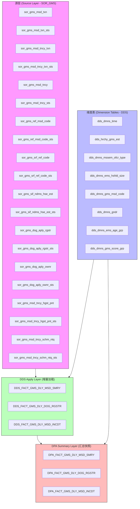
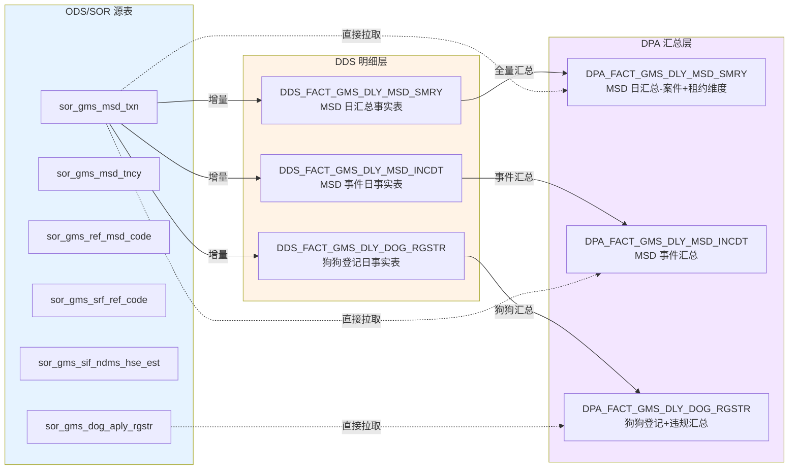

# WF_GMS_DDS_APLY_DLY - Data Logic Documentation

## 工作流概览 (Workflow Overview)

| 项目 | 原始 Informatica | 转换后 PySpark |
|------|-----------------|----------------|
| **工作流名称** | WF_GMS_DDS_APLY_DLY | workflow.py |
| **源数据库** | Oracle (DDS/DPA) | MSSQL (msscdm_dev / cmx_ors_10_3) |
| **目标数据库** | Oracle (DDS/DPA) | Delta Lake / MSSQL (msscdm_dev3) |
| **运行模式** | PowerCenter Worklet 并行执行 | 顺序执行所有 Mapping |
| **快照日期参数** | `$$v_snsh_date` (yyyyMMdd 格式) | `$$v_snsh_date` (保留在 SQL 中) |

---

## 工作流执行顺序

### 原始 XML 结构 (WF_GMS_DDS_APLY_DLY)

```
Workflow: WF_GMS_DDS_APLY_DLY
├── Worklet: WL_GMS_DDS_APY  (Apply - DDS 层数据写入)
│   ├── Start
│   ├── S_DDS_APL_FACT_GMS_DLY_MSD_INCDT  (并行)
│   ├── S_DDS_APL_FACT_GMS_DLY_MSD_SMRY   (并行)
│   └── S_DDS_APL_FACT_GMS_DLY_DOG_RGSTR  (并行)
│
├── Worklet: WL_GMS_DDS_SUM  (Summary - DPA 层汇总)
│   ├── Start
│   ├── S_DPA_SUM_FACT_GMS_DLY_MSD_INCDT  (并行)
│   ├── S_DPA_SUM_FACT_GMS_DLY_MSD_SMRY   (并行)
│   └── S_DPA_SUM_FACT_GMS_DLY_DOG_RGSTR  (并行)
│
├── T_MAIL_SUCCESS  (成功通知邮件)
└── T_MAIL_FAIL     (失败通知邮件)
```

### PySpark 转换结构 (workflow.py)

```
workflow.py (顺序执行)
├── M_DDS_APL_FACT_GMS_DLY_MSD_SMRY
├── M_DDS_APL_FACT_GMS_DLY_DOG_RGSTR
├── M_DDS_APL_FACT_GMS_DLY_MSD_INCDT
├── M_DPA_SUM_FACT_GMS_DLY_MSD_INCDT
├── M_DPA_SUM_FACT_GMS_DLY_MSD_SMRY
├── M_DPA_SUM_FACT_GMS_DLY_DOG_RGSTR
├── M_UTL_PARAM_SETUP
└── M_UTL_DPA_TRUNCATE
```

---

## 数据流架构图



---

## 详细 Mapping 数据逻辑

### 1. M_DDS_APL_FACT_GMS_DLY_MSD_SMRY

**目标表**: `DDS_FACT_GMS_DLY_MSD_SMRY`

**数据流向**: DPA 快照表 → DDS 明细表 (每日快照增量更新)

**Pipeline 1: DPA → DDS (DD_INSERT)**
- **源 (Source Qualifier - SQ_DPA)**: `DPA_FACT_GMS_DLY_MSD_SMRY`
- **操作**: DD_INSERT (仅插入新数据)
- **目标**: `DDS_FACT_GMS_DLY_MSD_SMRY` (管道 2)
- **选择字段**:
  - `time_dmns_key`, `est_scd_key`, `ofcr_type_dmns_key`, `hshld_size_dmns_key`
  - `msd_code_scd_key`, `ofndr_gndr_dmns_key`, `ofndr_age_grp_dmns_key`, `ofnc_score_grp_dmns_key`
  - 所有计数指标字段 (actv_ofnc_tncy_cnt, cmlt_ofnc_tncy_cnt 等)
  - `rec_rls_ind`, `last_rec_txn_date`, `last_rec_txn_type_code`

**Pipeline 2: DDS 原表清理 (DD_DELETE)**
- **源 (Source Qualifier - SQ_DDS)**: `select time_dmns_key from dds_dmns_time where time_val_date=to_date($$v_snsh_date,'yyyyMMdd') and time_dmns_key<200000000`
- **操作**: DD_DELETE (删除快照日期对应的已有记录)
- **目标**: `DDS_FACT_GMS_DLY_MSD_SMRY` (管道 1)
- **逻辑**: 先删除当天已有数据，再从 DPA 插入新数据

> **⚠️ PySpark 问题**: UPDTRANS 的 `_update_flag` 始终设置为 `'I'` (插入)，没有实现 DD_DELETE 逻辑。这会导致重复数据。

---

### 2. M_DDS_APL_FACT_GMS_DLY_DOG_RGSTR

**目标表**: `DDS_FACT_GMS_DLY_DOG_RGSTR`

**数据流向**: DPA 狗狗登记快照 → DDS 狗狗登记明细

**同样有两条 Pipeline**:
- **Pipeline 1 (DD_DELETE)**: 从 `dds_dmns_time` 获取快照日期的 `time_dmns_key`，删除旧数据
- **Pipeline 2 (DD_INSERT)**: 从 `DPA_FACT_GMS_DLY_DOG_RGSTR` 插入所有字段

---

### 3. M_DDS_APL_FACT_GMS_DLY_MSD_INCDT

**目标表**: `DDS_FACT_GMS_DLY_MSD_INCDT`

**数据流向**: DPA 事件快照 → DDS 事件明细

**单条 Pipeline (DD_INSERT)**:
- **源**: `DPA_FACT_GMS_DLY_MSD_INCDT`
- 直接插入到 DDS 目标表

---

### 4. M_DPA_SUM_FACT_GMS_DLY_MSD_SMRY ⭐ (核心业务逻辑)

**目标表**: `DPA_FACT_GMS_DLY_MSD_SMRY`

**数据流向**: DDS 明细 + SOR 源表 → DPA 汇总快照

**这是整个工作流最复杂的 Mapping**，包含两个 UNION ALL 的视图：

#### 视图 A: Case View (按案件维度汇总)

**源 (CTE `m`)**: 从 SOR 源表获取 MSD 交易数据
```sql
-- CTE 'm' 从以下表关联:
sor_gms_msd_txn t
  JOIN sor_gms_msd_txn_sts ts ON t.msd_txn_key = ts.msd_txn_key
  JOIN sor_gms_msd_tncy_txn tc ON t.msd_txn_key = tc.msd_txn_key
  JOIN sor_gms_msd_tncy_txn_sts tcs ON tc.msd_tncy_txn_key = tcs.msd_tncy_txn_key
  JOIN sor_gms_msd_tncy c ON tc.msd_tncy_key = c.msd_tncy_key
  JOIN sor_gms_msd_tncy_sts cs ON c.msd_tncy_key = cs.msd_tncy_key
```
- 条件: `tcs.msd_tncy_txn_sts_code='ACTV'`
- 日期过滤: `to_date($$v_snsh_date,'yyyyMMdd') between ... bgn_date and end_date` (对 ts, tcs, cs)

**业务逻辑 (从 `m` 展开)**:

1. **编码映射规则**:
   - `ofcr_type_code`: 将 `msd_iss_ofcr_type_code` 映射为 0, 1, 2, N/A
   - `hshld_size_code`: 非 DOM 方案为 N/A, 根据 `mbr_size_num` 分段 (<10 显示具体值, >=10 显示 "10+")
   - `gndr_code`: M → M, F → F, 其他 → N/A
   - `age_grp_code`: 根据 `ofndr_dob_date` 计算年龄分组 (0-19, 20-39, 40-59, 60+, N/A)
   - `score_grp_code`: 根据 `msd_pnt_num` 分段 (N/A, 3-9, 10-15, 16+)
   - 特殊情况: `SCHM_DOM` 以外 → N/A; `msd_type_code != 'PNT'` → N/A

2. **案件标识生成** (使用 `msd_txn_key` 作为 DISTINCT 标识):
   - `cmlt_wrt_warn_case`: `msd_type_code='WRT_WARN'` 且状态为 ACTV/INACTV/END
   - `aft_cmlt_wrt_warn_case`: 同上 + `msd_txn_cre_date >= 2007-01-01`
   - `actv_pnt_allt_case`: `tncy_sts_code='A'` + `msd_txn_sts_code='ACTV'` + `msd_type_code='PNT'`
   - `cmlt_pnt_allt_case`: `msd_type_code='PNT'` 且状态 ACTV/INACTV/END
   - `cmlt_msd_tot_case`: `msd_type_code IN ('PNT','OTHR')` 且(状态 ACTV/INACTV/END 或 (状态 DEL 且删除原因不为 DEL_DOM_06))
   - `actv_ofnc_tncy`: 使用 `msd_tncy_key` 标识活跃的 PNT 租约

3. **维度关联**: 通过编码值关联到维度表的 Key
   - 使用 `(+)` (Oracle LEFT JOIN) 关联 `dds_hrchy_gms_est`, `dds_dmns_mssem_ofcr_type`, `dds_dmns_ems_hshld_size`, `dds_dmns_gms_msd_code`, `dds_dmns_gndr`, `dds_dmns_ems_age_grp`, `dds_dmns_gms_score_grp`

4. **过滤条件**: 确保至少有一个计数 > 0

#### 视图 B: Tenancy View (按租约维度汇总)

**源**: 四个子查询 UNION ALL

| 子查询 | 来源 | 说明 |
|--------|------|------|
| `src_type='1'` | CTE `m` | 活跃 PNT 租约，按 `msd_tncy_key` GROUP BY |
| `src_type='2'` | `sor_gms_msd_tncy_hgst_pnt` | 租约最高分记录 |
| `src_type='3'` | `sor_gms_msd_tncy_schm_ntq` | 租约方案配额记录 |
| `src_type='4'` | CTE `m` | 2007年后 WRT_WARN 租约 |

**维度映射**:
- `msd_code_scd_key`: 根据方案类型硬编码 (-1=DOG, -2=DOM, -3=FTRY, -4=SHOP)
- `score_grp_code`: `src_type='3'` 特殊处理为 '16+Excld'

**输出指标**:
- `actv_ofnc_tncy_cnt`: 活跃违规租约数
- `cmlt_ofnc_tncy_cnt`: 累计违规租约数
- `aft_cmlt_wrt_warn_tncy_cnt`: 2007年后书面警告租约数

---

### 5. M_DPA_SUM_FACT_GMS_DLY_MSD_INCDT

**目标表**: `DPA_FACT_GMS_DLY_MSD_INCDT`

**核心业务逻辑**: 从 SOR 源表提取事件层面的 MSD 数据

**源表关联** (与 M_DPA_SUM_FACT_GMS_DLY_MSD_SMRY 类似但更简单):
- `sor_gms_msd_txn` + `sor_gms_msd_txn_sts` + `sor_gms_msd_tncy_txn` + `sor_gms_msd_tncy_txn_sts` + `sor_gms_msd_tncy` + `sor_gms_msd_tncy_sts`
- `sor_gms_ref_msd_code` + `sor_gms_ref_msd_code_sts`
- `sor_gms_srf_ref_code` + `sor_gms_srf_ref_code_sts`
- `sor_gms_sif_ndms_hse_est` + `sor_gms_sif_ndms_hse_est_sts`

**过滤条件**: `ts.msd_type_code IN ('PNT', 'WRT_WARN')` 且 `ts.msd_txn_sts_code != 'DEL'`

**编码映射**: 与 MSD_SMRY 相同的维度编码规则

**时间维度关联**:
- `incdt_date_time` → `dds_dmns_time t1` (事件日期)
- `msd_txn_cre_date` → `dds_dmns_time t2` (创建日期)

**聚合指标** (GROUP BY 维度):
- `aft_cmlt_wrt_warn_case_cnt`: `count(distinct ...)` WRT_WARN 且 2007年后
- `cmlt_pnt_allt_case_cnt`: `count(distinct ...)` PNT 类型案件

> **注意**: 与 SMRY 不同，INCDT 仅处理 PNT 和 WRT_WARN 两种类型(不包括 OTHR)，且不含 DEL 记录的排除逻辑

---

### 6. M_DPA_SUM_FACT_GMS_DLY_DOG_RGSTR

**目标表**: `DPA_FACT_GMS_DLY_DOG_RGSTR`

**业务逻辑**: 按机构汇总狗狗登记和违规数据

**两个 UNION ALL 子查询**:

| 子查询 | 来源 | 聚合逻辑 |
|--------|------|----------|
| 狗狗登记 | `sor_gms_dog_aply_rgstr` + `sor_gms_dog_aply_rgstr_sts` + `sor_gms_dog_aply_ownr` + `sor_gms_dog_aply_ownr_sts` | `aprv_cnt` = 状态为 VLD/ND/NV; `aprv_cncl_cnt` = 状态为 DEL |
| 违规事件 | `sor_gms_msd_txn` + 关联表 (同 MSD 源) | `auth_dog_pnt_allt_case_cnt` = SCHM_DOG; `unauth_dog_pnt_allt_case_cnt` = SCHM_DOM 且 msd_code IN ('B3','B4') |

**最终 GROUP BY**: 按 `est_scd_key` 汇总计数

---

### 7. M_UTL_PARAM_SETUP

**源**: `SOR_SYS_PRPTY` (系统属性表)
**目标**: `UTL_JOB_PARAM` (作业参数文件)

**逻辑**: 从系统属性表读取参数配置 (VAL, PRPTY_DESP, PRPTY)

---

### 8. M_UTL_DPA_TRUNCATE

**源**: `UTL_SSA_TBL_LIST` (表列表文件)
**目标**: `UTL_DEV_NULL`

**逻辑**: 截断 DPA 层目标表 (清空汇总数据，为当天重新加载做准备)

---

## 转换对比分析 Review

### ✅ 正确保留的逻辑

| 项目 | 状态 | 说明 |
|------|------|------|
| SQL 查询语句 | ✅ | SQL pushdown 完整保留了 Oracle SQL 文本 |
| 维度编码规则 | ✅ | 完整的 CASE WHEN 逻辑嵌入在 SQL 中 |
| 核心业务指标 | ✅ | 所有 count(distinct ...) 聚合逻辑保留 |
| 目标表字段映射 | ✅ | 字段选择和列名映射完整 |
| 维度表关联 | ✅ | 所有 LEFT JOIN 和维度 key 转换保留 |

### ⚠️ 存在问题

| 问题 | 严重性 | 说明 |
|------|--------|------|
| **Oracle SQL 方言** | 🔴 **严重** | PySpark SQL pushdown 中使用了 Oracle 专有函数: `to_date()`, `add_months()`, `sysdate`, `nvl()`, `trunc()`, `(+)` outer join 语法。这些在 MSSQL 中无法执行。 |
| **$$v_snsh_date 参数** | 🔴 **严重** | 参数 `$$v_snsh_date` 是 Oracle 映射变量，PySpark 未做参数替换，MSSQL 无法识别。 |
| **Update Strategy 错误** | 🟡 **中等** | UPDTRANS (DD_DELETE) 在 PySpark 中始终生成 `_update_flag='I'`，未实际执行删除逻辑，会导致目标表数据重复。 |
| **数据库类型差异** | 🔴 **严重** | 原始 Oracle 连接 DDS/DPA，转换后指向 MSSQL (msscdm_dev/cmx_ors_10_3)，表名和 Schema 完全不同且未做映射。 |
| **并行→串行** | 🟡 **中等** | 原始 XML 中三个 Session 在 Worklet 内并行执行；PySpark 顺序执行，性能有差异但逻辑一致。 |
| **Delta 格式写入** | 🟡 **中等** | 目标表写入采用 `delta` 格式 `saveAsTable()`，与原始 Oracle JDBC 写入行为不同。 |
| **EMapping 排序** | 🟡 **中等** | PySpark 的输出字段排序使用了 `target_col_map` 映射，顺序可能与目标表定义不完全一致。 |
| **Boilerplate 冗余** | 🟢 **低** | 每个 mapping 文件都包含完全相同的配置加载、连接设置、辅助函数代码（~500行），缺乏模块化。 |

### 🔴 关键风险总结

1. **SQL 兼容性问题**: 整个转换依赖于"SQL Pushdown"策略——将 Oracle SQL 原封不动地推送到 MSSQL 执行。由于 Oracle 和 MSSQL 的 SQL 方言差异，这些 SQL 在 MSSQL 上**必然执行失败**。

2. **数据源映射缺失**: 原始 Informatica 中表的拥有者是 `PDDS` (Oracle Schema)，指向 Oracle 数据库 `DDS`/`DPA`。转换后的配置指向 MSSQL 数据库 (`msscdm_dev`/`cmx_ors_10_3`)，但没有表名到表名的映射，物理表可能不存在。

3. **增量加载策略不完整**: DD_DELETE + DD_INSERT 是典型的"先删后插"增量策略，但 PySpark 中删除部分未正确实现。

---

## 核心业务概念 Glossary

| 缩写 | 英文全称 | 中文说明 |
|------|---------|---------|
| GMS | General Misconduct Supervision | 一般行为失当监管 |
| MSD | Misconduct | 行为失当/违规 |
| DDS | Data Distribution System (明细层) | 数据分发系统 - 明细数据层 |
| DPA | Data Presentation Area (汇总层) | 数据展示区 - 汇总数据层 |
| SCD | Slowly Changing Dimension | 缓慢变化维度 |
| TNCT | Tenancy | 租约/合约 |
| PNT | Point (扣分) | 扣分类型违规 |
| WRT_WARN | Written Warning | 书面警告 |
| OTHR | Other (其他违规) | 其他类型违规 |
| DOG | Dog (狗只) | 涉及狗只的案件 |
| DOM | Domestic (家事) | 家事/家庭案件 |
| SCHM | Scheme | 方案类型 |
| OFCR | Officer | 人员类型(调查人员) |
| EST | Establishment | 场所/机构 |
| HSHLD | Household | 家庭/住户 |
| APRV | Approved | 已批准 |
| CNCL | Cancel/Cancellation | 取消 |
| SNAPSHOT_DATE | `$$v_snsh_date` | 快照日期(格式 yyyyMMdd) |

---

## 数据血缘总结



*说明: 虚线箭头表示 M_DPA_SUM_* 类 Mapping 直接从 SOR 源表拉取数据计算汇总，实线箭头表示 M_DDS_APL_* 类 Mapping 从 DPA 快照加载到 DDS 明细。*
