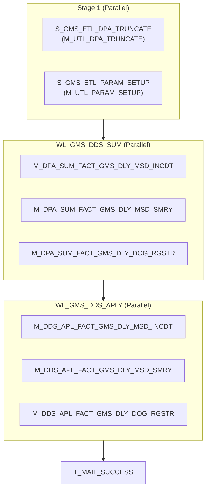

# WF_GMS_DDS_APLY_DLY

## Execution Flow

Auto-generated from Informatica PowerCenter workflow

## Session to Mapping

| Session | Mapping | Type |
|---------|---------|------|
| S_GMS_ETL_DPA_TRUNCATE | M_UTL_DPA_TRUNCATE | Parallel |
| S_GMS_ETL_PARAM_SETUP | M_UTL_PARAM_SETUP | Parallel |
| S_DPA_SUM_FACT_GMS_DLY_MSD_INCDT | M_DPA_SUM_FACT_GMS_DLY_MSD_INCDT | Worklet |
| S_DPA_SUM_FACT_GMS_DLY_MSD_SMRY | M_DPA_SUM_FACT_GMS_DLY_MSD_SMRY | Worklet |
| S_DPA_SUM_FACT_GMS_DLY_DOG_RGSTR | M_DPA_SUM_FACT_GMS_DLY_DOG_RGSTR | Worklet |
| S_DDS_APL_FACT_GMS_DLY_MSD_INCDT | M_DDS_APL_FACT_GMS_DLY_MSD_INCDT | Worklet |
| S_DDS_APL_FACT_GMS_DLY_MSD_SMRY | M_DDS_APL_FACT_GMS_DLY_MSD_SMRY | Worklet |
| S_DDS_APL_FACT_GMS_DLY_DOG_RGSTR | M_DDS_APL_FACT_GMS_DLY_DOG_RGSTR | Worklet |
| T_MAIL_SUCCESS | - | Task |