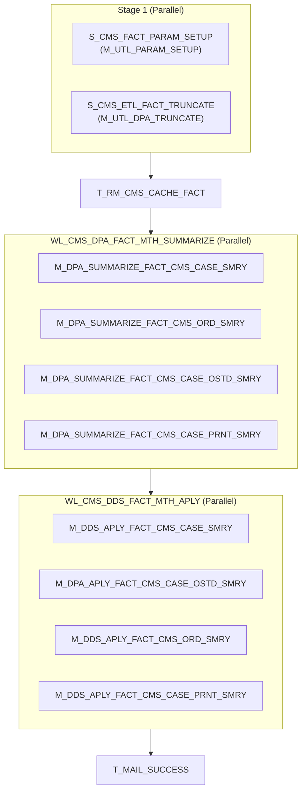

# WF_CMS_DDS_APLY_MTH

## Execution Flow

Auto-generated from Informatica PowerCenter workflow

## Session to Mapping

| Session | Mapping | Type |
|---------|---------|------|
| S_CMS_FACT_PARAM_SETUP | M_UTL_PARAM_SETUP | Parallel |
| S_CMS_ETL_FACT_TRUNCATE | M_UTL_DPA_TRUNCATE | Parallel |
| T_RM_CMS_CACHE_FACT | - | Task |
| S_DPA_SUMMARIZE_FACT_CMS_CASE_SMRY | M_DPA_SUMMARIZE_FACT_CMS_CASE_SMRY | Worklet |
| S_DPA_SUMMARIZE_FACT_CMS_ORD_SMRY | M_DPA_SUMMARIZE_FACT_CMS_ORD_SMRY | Worklet |
| S_DPA_SUMMARIZE_FACT_CMS_CASE_OSTD_SMRY | M_DPA_SUMMARIZE_FACT_CMS_CASE_OSTD_SMRY | Worklet |
| S_DPA_SUMMARIZE_FACT_CMS_CASE_PRNT_SMRY | M_DPA_SUMMARIZE_FACT_CMS_CASE_PRNT_SMRY | Worklet |
| S_DDS_APLY_FACT_CMS_CASE_SMRY | M_DDS_APLY_FACT_CMS_CASE_SMRY | Worklet |
| S_DDS_APLY_FACT_CMS_CASE_OSTD_SMRY | M_DPA_APLY_FACT_CMS_CASE_OSTD_SMRY | Worklet |
| S_DDS_APLY_FACT_CMS_ORD_SMRY | M_DDS_APLY_FACT_CMS_ORD_SMRY | Worklet |
| S_DDS_APLY_FACT_CMS_CASE_PRNT_SMRY | M_DDS_APLY_FACT_CMS_CASE_PRNT_SMRY | Worklet |
| T_MAIL_SUCCESS | - | Task |