# WF_EMS_PRHE_DDS_APLY_RVN_MTH

## Execution Flow

Auto-generated from Informatica PowerCenter workflow

```mermaid
flowchart TD
    subgraph Stage1["Stage 1 (Parallel)"]
        S_EMS_PRHE_RVN_MTH_PARAM_SETUP["S_EMS_PRHE_RVN_MTH_PARAM_SETUP<br/>(M_UTL_PARAM_SETUP)"]
        S_EMS_PRHE_RVN_MTH_DPA_TRUNCATE["S_EMS_PRHE_RVN_MTH_DPA_TRUNCATE<br/>(M_UTL_DPA_TRUNCATE)"]
    end
    Decision["Decision"]
    subgraph Stage2["Stage 2 (Parallel)"]
        S_EMS_DPA_SUMMARIZE_FACT_MTH_DRP_SWD_CLCT_SMRY_A["S_EMS_DPA_SUMMARIZE_FACT_MTH_DRP_SWD_CLCT_SMRY_A<br/>(M_EMS_DPA_SUMMARIZE_FACT_MTH_DRP_SWD_CLCT_SMRY_A)"]
        S_EMS_DPA_SUMMARIZE_FACT_MTH_RENT_AND_ARR_SMRY_A["S_EMS_DPA_SUMMARIZE_FACT_MTH_RENT_AND_ARR_SMRY_A<br/>(M_EMS_DPA_SUMMARIZE_FACT_MTH_RENT_AND_ARR_SMRY_A)"]
        S_EMS_SSAL1_EXTR_CSA_DRP_SWD_PRLM_PYMT_RAW["S_EMS_SSAL1_EXTR_CSA_DRP_SWD_PRLM_PYMT_RAW<br/>(M_EMS_SSAL1_EXTR_CSA_DRP_SWD_PRLM_PYMT_RAW)"]
        S_EMS_DPA_SUMMARIZE_FACT_TNCY_AND_PLT_SMRY["S_EMS_DPA_SUMMARIZE_FACT_TNCY_AND_PLT_SMRY<br/>(M_EMS_DPA_SUMMARIZE_FACT_TNCY_AND_PLT_SMRY)"]
    end
    subgraph Stage3["Stage 3 (Parallel)"]
        S_EMS_SOR_LOAD_CSA_DRP_SWD_PRLM_PYMT_RAW_FOR_DELETE["S_EMS_SOR_LOAD_CSA_DRP_SWD_PRLM_PYMT_RAW_FOR_DELETE<br/>(M_EMS_SOR_LOAD_CSA_DRP_SWD_PRLM_PYMT_RAW_FOR_DELETE)"]
        S_EMS_DDS_APLY_FACT_TNCY_AND_PLT_SMRY["S_EMS_DDS_APLY_FACT_TNCY_AND_PLT_SMRY<br/>(M_EMS_DDS_APLY_FACT_TNCY_AND_PLT_SMRY)"]
        S_EMS_DPA_SUMMARIZE_FACT_MTH_DRP_SWD_CLCT_SMRY_B["S_EMS_DPA_SUMMARIZE_FACT_MTH_DRP_SWD_CLCT_SMRY_B<br/>(M_EMS_DPA_SUMMARIZE_FACT_MTH_DRP_SWD_CLCT_SMRY_B)"]
        S_EMS_DPA_SUMMARIZE_FACT_MTH_RENT_AND_ARR_SMRY_B["S_EMS_DPA_SUMMARIZE_FACT_MTH_RENT_AND_ARR_SMRY_B<br/>(M_EMS_DPA_SUMMARIZE_FACT_MTH_RENT_AND_ARR_SMRY_B)"]
    end
    subgraph Stage4["Stage 4 (Parallel)"]
        S_EMS_SOR_LOAD_CSA_DRP_SWD_PRLM_PYMT_RAW_FOR_INSERT["S_EMS_SOR_LOAD_CSA_DRP_SWD_PRLM_PYMT_RAW_FOR_INSERT<br/>(M_EMS_SOR_LOAD_CSA_DRP_SWD_PRLM_PYMT_RAW_FOR_INSERT)"]
        S_EMS_DDS_APLY_FACT_MTH_DRP_SWD_CLCT_SMRY["S_EMS_DDS_APLY_FACT_MTH_DRP_SWD_CLCT_SMRY<br/>(M_EMS_DDS_APLY_FACT_MTH_DRP_SWD_CLCT_SMRY)"]
        S_EMS_DPA_SUMMARIZE_FACT_MTH_RENT_AND_ARR_SMRY_C["S_EMS_DPA_SUMMARIZE_FACT_MTH_RENT_AND_ARR_SMRY_C<br/>(M_EMS_DPA_SUMMARIZE_FACT_MTH_RENT_AND_ARR_SMRY_C)"]
    end
    S_EMS_DPA_SUMMARIZE_FACT_MTH_RENT_AND_ARR_SMRY_D["S_EMS_DPA_SUMMARIZE_FACT_MTH_RENT_AND_ARR_SMRY_D<br/>(M_EMS_DPA_SUMMARIZE_FACT_MTH_RENT_AND_ARR_SMRY_D)"]
    Decision1["Decision1"]
    subgraph Stage5["Stage 5 (Parallel)"]
        S_EMS_DDS_APLY_MTH_DRP_SWD_STAT["S_EMS_DDS_APLY_MTH_DRP_SWD_STAT<br/>(M_EMS_DDS_APLY_MTH_DRP_SWD_STAT)"]
        S_EMS_DDS_APLY_FACT_MTH_RENT_AND_ARR_SMRY["S_EMS_DDS_APLY_FACT_MTH_RENT_AND_ARR_SMRY<br/>(M_EMS_DDS_APLY_FACT_MTH_RENT_AND_ARR_SMRY)"]
        S_EMS_DPA_SUMMARIZE_FACT_TNCY_AND_HSHLD_SMRY["S_EMS_DPA_SUMMARIZE_FACT_TNCY_AND_HSHLD_SMRY<br/>(M_EMS_DPA_SUMMARIZE_FACT_TNCY_AND_HSHLD_SMRY)"]
    end
    subgraph Stage6["Stage 6 (Parallel)"]
        S_EMS_DDS_APLY_FACT_TNCY_AND_HSHLD_SMRY["S_EMS_DDS_APLY_FACT_TNCY_AND_HSHLD_SMRY<br/>(M_EMS_DDS_APLY_FACT_TNCY_AND_HSHLD_SMRY)"]
        S_EMS_DDS_APLY_FACT_MTH_RENT_AND_ARR_SMRY_FOR_UPDATE["S_EMS_DDS_APLY_FACT_MTH_RENT_AND_ARR_SMRY_FOR_UPDATE<br/>(M_EMS_DDS_APLY_FACT_MTH_RENT_AND_ARR_SMRY_FOR_UPDATE)"]
    end
    S_EMS_DPA_SUMMARIZE_FACT_RENT_ENQ_RMDR_SMRY_A["S_EMS_DPA_SUMMARIZE_FACT_RENT_ENQ_RMDR_SMRY_A<br/>(M_EMS_DPA_SUMMARIZE_FACT_RENT_ENQ_RMDR_SMRY_A)"]
    S_EMS_DPA_SUMMARIZE_FACT_RENT_ENQ_RMDR_SMRY_B["S_EMS_DPA_SUMMARIZE_FACT_RENT_ENQ_RMDR_SMRY_B<br/>(M_EMS_DPA_SUMMARIZE_FACT_RENT_ENQ_RMDR_SMRY_B)"]
    S_EMS_DPA_SUMMARIZE_FACT_RENT_ENQ_RMDR_SMRY_C["S_EMS_DPA_SUMMARIZE_FACT_RENT_ENQ_RMDR_SMRY_C<br/>(M_EMS_DPA_SUMMARIZE_FACT_RENT_ENQ_RMDR_SMRY_C)"]
    S_EMS_DPA_SUMMARIZE_FACT_RENT_ENQ_RMDR_SMRY_D["S_EMS_DPA_SUMMARIZE_FACT_RENT_ENQ_RMDR_SMRY_D<br/>(M_EMS_DPA_SUMMARIZE_FACT_RENT_ENQ_RMDR_SMRY_D)"]
    S_EMS_DPA_SUMMARIZE_FACT_RENT_ENQ_RMDR_SMRY_E["S_EMS_DPA_SUMMARIZE_FACT_RENT_ENQ_RMDR_SMRY_E<br/>(M_EMS_DPA_SUMMARIZE_FACT_RENT_ENQ_RMDR_SMRY_E)"]
    S_EMS_DDS_APLY_FACT_RENT_ENQ_RMDR_SMRY["S_EMS_DDS_APLY_FACT_RENT_ENQ_RMDR_SMRY<br/>(M_EMS_DDS_APLY_FACT_RENT_ENQ_RMDR_SMRY)"]
    T_MAIL_SUCCESS["T_MAIL_SUCCESS"]
    Stage1 --> Decision
    Decision --> Stage2
    Stage2 --> Stage3
    Stage3 --> Stage4
    Stage4 --> S_EMS_DPA_SUMMARIZE_FACT_MTH_RENT_AND_ARR_SMRY_D
    S_EMS_DPA_SUMMARIZE_FACT_MTH_RENT_AND_ARR_SMRY_D --> Decision1
    Decision1 --> Stage5
    Stage5 --> Stage6
    Stage6 --> S_EMS_DPA_SUMMARIZE_FACT_RENT_ENQ_RMDR_SMRY_A
    S_EMS_DPA_SUMMARIZE_FACT_RENT_ENQ_RMDR_SMRY_A --> S_EMS_DPA_SUMMARIZE_FACT_RENT_ENQ_RMDR_SMRY_B
    S_EMS_DPA_SUMMARIZE_FACT_RENT_ENQ_RMDR_SMRY_B --> S_EMS_DPA_SUMMARIZE_FACT_RENT_ENQ_RMDR_SMRY_C
    S_EMS_DPA_SUMMARIZE_FACT_RENT_ENQ_RMDR_SMRY_C --> S_EMS_DPA_SUMMARIZE_FACT_RENT_ENQ_RMDR_SMRY_D
    S_EMS_DPA_SUMMARIZE_FACT_RENT_ENQ_RMDR_SMRY_D --> S_EMS_DPA_SUMMARIZE_FACT_RENT_ENQ_RMDR_SMRY_E
    S_EMS_DPA_SUMMARIZE_FACT_RENT_ENQ_RMDR_SMRY_E --> S_EMS_DDS_APLY_FACT_RENT_ENQ_RMDR_SMRY
    S_EMS_DDS_APLY_FACT_RENT_ENQ_RMDR_SMRY --> T_MAIL_SUCCESS
```

## Session to Mapping

| Session | Mapping | Type |
|---------|---------|------|
| S_EMS_PRHE_RVN_MTH_PARAM_SETUP | M_UTL_PARAM_SETUP | Parallel |
| S_EMS_PRHE_RVN_MTH_DPA_TRUNCATE | M_UTL_DPA_TRUNCATE | Parallel |
| Decision | - | Task |
| S_EMS_DPA_SUMMARIZE_FACT_MTH_DRP_SWD_CLCT_SMRY_A | M_EMS_DPA_SUMMARIZE_FACT_MTH_DRP_SWD_CLCT_SMRY_A | Parallel |
| S_EMS_DPA_SUMMARIZE_FACT_MTH_RENT_AND_ARR_SMRY_A | M_EMS_DPA_SUMMARIZE_FACT_MTH_RENT_AND_ARR_SMRY_A | Parallel |
| S_EMS_SSAL1_EXTR_CSA_DRP_SWD_PRLM_PYMT_RAW | M_EMS_SSAL1_EXTR_CSA_DRP_SWD_PRLM_PYMT_RAW | Parallel |
| S_EMS_DPA_SUMMARIZE_FACT_TNCY_AND_PLT_SMRY | M_EMS_DPA_SUMMARIZE_FACT_TNCY_AND_PLT_SMRY | Parallel |
| S_EMS_SOR_LOAD_CSA_DRP_SWD_PRLM_PYMT_RAW_FOR_DELETE | M_EMS_SOR_LOAD_CSA_DRP_SWD_PRLM_PYMT_RAW_FOR_DELETE | Parallel |
| S_EMS_DDS_APLY_FACT_TNCY_AND_PLT_SMRY | M_EMS_DDS_APLY_FACT_TNCY_AND_PLT_SMRY | Parallel |
| S_EMS_DPA_SUMMARIZE_FACT_MTH_DRP_SWD_CLCT_SMRY_B | M_EMS_DPA_SUMMARIZE_FACT_MTH_DRP_SWD_CLCT_SMRY_B | Parallel |
| S_EMS_DPA_SUMMARIZE_FACT_MTH_RENT_AND_ARR_SMRY_B | M_EMS_DPA_SUMMARIZE_FACT_MTH_RENT_AND_ARR_SMRY_B | Parallel |
| S_EMS_SOR_LOAD_CSA_DRP_SWD_PRLM_PYMT_RAW_FOR_INSERT | M_EMS_SOR_LOAD_CSA_DRP_SWD_PRLM_PYMT_RAW_FOR_INSERT | Parallel |
| S_EMS_DDS_APLY_FACT_MTH_DRP_SWD_CLCT_SMRY | M_EMS_DDS_APLY_FACT_MTH_DRP_SWD_CLCT_SMRY | Parallel |
| S_EMS_DPA_SUMMARIZE_FACT_MTH_RENT_AND_ARR_SMRY_C | M_EMS_DPA_SUMMARIZE_FACT_MTH_RENT_AND_ARR_SMRY_C | Parallel |
| S_EMS_DPA_SUMMARIZE_FACT_MTH_RENT_AND_ARR_SMRY_D | M_EMS_DPA_SUMMARIZE_FACT_MTH_RENT_AND_ARR_SMRY_D | Sequential |
| Decision1 | - | Task |
| S_EMS_DDS_APLY_MTH_DRP_SWD_STAT | M_EMS_DDS_APLY_MTH_DRP_SWD_STAT | Parallel |
| S_EMS_DDS_APLY_FACT_MTH_RENT_AND_ARR_SMRY | M_EMS_DDS_APLY_FACT_MTH_RENT_AND_ARR_SMRY | Parallel |
| S_EMS_DPA_SUMMARIZE_FACT_TNCY_AND_HSHLD_SMRY | M_EMS_DPA_SUMMARIZE_FACT_TNCY_AND_HSHLD_SMRY | Parallel |
| S_EMS_DDS_APLY_FACT_TNCY_AND_HSHLD_SMRY | M_EMS_DDS_APLY_FACT_TNCY_AND_HSHLD_SMRY | Parallel |
| S_EMS_DDS_APLY_FACT_MTH_RENT_AND_ARR_SMRY_FOR_UPDATE | M_EMS_DDS_APLY_FACT_MTH_RENT_AND_ARR_SMRY_FOR_UPDATE | Parallel |
| S_EMS_DPA_SUMMARIZE_FACT_RENT_ENQ_RMDR_SMRY_A | M_EMS_DPA_SUMMARIZE_FACT_RENT_ENQ_RMDR_SMRY_A | Sequential |
| S_EMS_DPA_SUMMARIZE_FACT_RENT_ENQ_RMDR_SMRY_B | M_EMS_DPA_SUMMARIZE_FACT_RENT_ENQ_RMDR_SMRY_B | Sequential |
| S_EMS_DPA_SUMMARIZE_FACT_RENT_ENQ_RMDR_SMRY_C | M_EMS_DPA_SUMMARIZE_FACT_RENT_ENQ_RMDR_SMRY_C | Sequential |
| S_EMS_DPA_SUMMARIZE_FACT_RENT_ENQ_RMDR_SMRY_D | M_EMS_DPA_SUMMARIZE_FACT_RENT_ENQ_RMDR_SMRY_D | Sequential |
| S_EMS_DPA_SUMMARIZE_FACT_RENT_ENQ_RMDR_SMRY_E | M_EMS_DPA_SUMMARIZE_FACT_RENT_ENQ_RMDR_SMRY_E | Sequential |
| S_EMS_DDS_APLY_FACT_RENT_ENQ_RMDR_SMRY | M_EMS_DDS_APLY_FACT_RENT_ENQ_RMDR_SMRY | Sequential |
| T_MAIL_SUCCESS | - | Task |