# WF_EMS_DDS_APLY_MTH

## Execution Flow

Auto-generated from Informatica PowerCenter workflow

```mermaid
flowchart TD
    n1["T_RM_EMS_CACHE"]
    style n1 fill:#ffd,stroke:#aaa,stroke-width:1px
    n2["S_EMS_ETL_PARAM_SETUP<br/><i>(M_UTL_PARAM_SETUP)</i>"]
    n3["S_EMS_ETL_DPA_TRUNCATE<br/><i>(M_UTL_DPA_TRUNCATE)</i>"]
    subgraph pg4[Parallel]
        n1
        n2
        n3
    end
    subgraph wkl5["WL_EMS_DPA_SMS_SUMMARIZE"]
    n6["S_S5_DPA_SUMMARIZE_FACT_EMS_SMS_PGS<br/><i>(M_S5_DPA_SUMMARIZE_FACT_EMS_SMS_PGS)</i>"]
    n7["S_S5_DPA_SUMMARIZE_FACT_EMS_SMS_TXN<br/><i>(M_S5_DPA_SUMMARIZE_FACT_EMS_SMS_TXN)</i>"]
    n8["S_S5_DPA_SUMMARIZE_FACT_EMS_SMS_RENT_TXN<br/><i>(M_S5_DPA_SUMMARIZE_FACT_EMS_SMS_RENT_TXN)</i>"]
    n9["S_S5_DPA_SUMMARIZE_FACT_EMS_SMS_APLY_TYPE_TXN<br/><i>(M_S5_DPA_SUMMARIZE_FACT_EMS_SMS_APLY_TYPE_TXN)</i>"]
    n10["S_S5_DPA_SUMMARIZE_FACT_EMS_SMS_FLAT_PRC_TXN<br/><i>(M_S5_DPA_SUMMARIZE_FACT_EMS_SMS_FLAT_PRC_TXN)</i>"]
    n11["S_S5_DPA_SUMMARIZE_FACT_EMS_SMS_PREM_PYMT_A<br/><i>(M_S5_DPA_SUMMARIZE_FACT_EMS_SMS_PREM_PYMT_A)</i>"]
    n12["S_S5_DPA_SUMMARIZE_FACT_EMS_SMS_CRT_HGST_SALE<br/><i>(M_S5_DPA_SUMMARIZE_FACT_EMS_SMS_CRT_HGST_SALE)</i>"]
    n13["S_S5_DPA_SUMMARIZE_FACT_EMS_SMS_FLAT_SIZE_TXN<br/><i>(M_S5_DPA_SUMMARIZE_FACT_EMS_SMS_FLAT_SIZE_TXN)</i>"]
    n14["S_S5_DPA_SUMMARIZE_FACT_EMS_SMS_DSTR_TXN<br/><i>(M_S5_DPA_SUMMARIZE_FACT_EMS_SMS_DSTR_TXN)</i>"]
    subgraph pg15[Parallel]
        n6
        n7
        n8
        n9
        n10
        n11
        n12
        n13
        n14
    end
    end
    subgraph wkl16["WL_EMS_DPA_NEW_SUMMARIZE"]
    n17["S_S5_DPA_SUMMARIZE_FACT_EMS_VCNT_FLAT<br/><i>(M_S5_DPA_SUMMARIZE_FACT_EMS_VCNT_FLAT)</i>"]
    n18["S_S5_DPA_SUMMARIZE_FACT_EMS_HSC_STCK<br/><i>(M_S5_DPA_SUMMARIZE_FACT_EMS_HSC_STCK)</i>"]
    n19["S_S5_DPA_SUMMARIZE_FACT_EMS_PRH_ABU<br/><i>(M_S5_DPA_SUMMARIZE_FACT_EMS_PRH_ABU)</i>"]
    n20["S_S5_DPA_SUMMARIZE_FACT_EMS_RMV_RDEV_ALWN<br/><i>(M_S5_DPA_SUMMARIZE_FACT_EMS_RMV_RDEV_ALWN)</i>"]
    n21["S_S5_DPA_SUMMARIZE_FACT_EMS_TNCY_TFR<br/><i>(M_S5_DPA_SUMMARIZE_FACT_EMS_TNCY_TFR)</i>"]
    n22["S_S5_DPA_SUMMARIZE_FACT_EMS_ADTN_DEL<br/><i>(M_S5_DPA_SUMMARIZE_FACT_EMS_ADTN_DEL)</i>"]
    n23["S_S5_DPA_SUMMARIZE_FACT_EMS_FLAT_RENT<br/><i>(M_S5_DPA_SUMMARIZE_FACT_EMS_FLAT_RENT)</i>"]
    subgraph pg24[Parallel]
        n17
        n18
        n19
        n20
        n21
        n22
        n23
    end
    n25["S_S5_DPA_SUMMARIZE_FACT_EMS_DSTR_COUNCIL_EST<br/><i>(M_S5_DPA_SUMMARIZE_FACT_EMS_DSTR_COUNCIL_EST)</i>"]
    n26["S_S5_DPA_SUMMARIZE_FACT_EMS_EST_PLT_D<br/><i>(M_S5_DPA_SUMMARIZE_FACT_EMS_EST_PLT_D)</i>"]
    n27["S_S5_DPA_SUMMARIZE_FACT_EMS_EST_PLT_B<br/><i>(M_S5_DPA_SUMMARIZE_FACT_EMS_EST_PLT_B)</i>"]
    n28["S_S5_DPA_SUMMARIZE_FACT_EMS_EST_PLT_C<br/><i>(M_S5_DPA_SUMMARIZE_FACT_EMS_EST_PLT_C)</i>"]
    n29["S_S5_DPA_SUMMARIZE_FACT_EMS_EST_PLT_A<br/><i>(M_S5_DPA_SUMMARIZE_FACT_EMS_EST_PLT_A)</i>"]
    n30["S_S5_DPA_SUMMARIZE_FACT_EMS_BD<br/><i>(M_S5_DPA_SUMMARIZE_FACT_EMS_BD)</i>"]
    n31["S_S5_DPA_SUMMARIZE_FACT_EMS_OVRCRD_RLF<br/><i>(M_S5_DPA_SUMMARIZE_FACT_EMS_OVRCRD_RLF)</i>"]
    n32["S_S5_DPA_SUMMARIZE_FACT_EMS_RAS_HDSP<br/><i>(M_S5_DPA_SUMMARIZE_FACT_EMS_RAS_HDSP)</i>"]
    n33["S_S5_DPA_SUMMARIZE_FACT_EMS_UND_OCPY<br/><i>(M_S5_DPA_SUMMARIZE_FACT_EMS_UND_OCPY)</i>"]
    subgraph pg34[Parallel]
        n32
        n33
    end
        pg24 --> n25
        n25 --> n26
        n26 --> n27
        n27 --> n28
        n28 --> n29
        n29 --> n30
        n30 --> n31
        n31 --> pg34
    end
    subgraph pg35[Parallel]
        wkl5
        wkl16
    end
    subgraph wkl36["WL_EMS_DDS_SMS_APLY"]
    n37["S_S5_DDS_APLY_FACT_EMS_SMS_CRT_HGST_SALE<br/><i>(M_S5_DDS_APLY_FACT_EMS_SMS_CRT_HGST_SALE)</i>"]
    n38["S_S5_DDS_APLY_FACT_EMS_SMS_FLAT_PRC_TXN<br/><i>(M_S5_DDS_APLY_FACT_EMS_SMS_FLAT_PRC_TXN)</i>"]
    n39["S_S5_DDS_APLY_FACT_EMS_SMS_PREM_PYMT<br/><i>(M_S5_DDS_APLY_FACT_EMS_SMS_PREM_PYMT)</i>"]
    n40["S_S5_DDS_APLY_FACT_EMS_SMS_DSTR_TXN<br/><i>(M_S5_DDS_APLY_FACT_EMS_SMS_DSTR_TXN)</i>"]
    n41["S_S5_DDS_APLY_FACT_EMS_SMS_FLAT_SIZE_TXN<br/><i>(M_S5_DDS_APLY_FACT_EMS_SMS_FLAT_SIZE_TXN)</i>"]
    n42["S_S5_DDS_APLY_FACT_EMS_SMS_TXN<br/><i>(M_S5_DDS_APLY_FACT_EMS_SMS_TXN)</i>"]
    n43["S_S5_DDS_APLY_FACT_EMS_SMS_APLY_TYPE_TXN<br/><i>(M_S5_DDS_APLY_FACT_EMS_SMS_APLY_TYPE_TXN)</i>"]
    n44["S_S5_DDS_APLY_FACT_EMS_SMS_RENT_TXN<br/><i>(M_S5_DDS_APLY_FACT_EMS_SMS_RENT_TXN)</i>"]
    n45["S_S5_DDS_APLY_FACT_EMS_SMS_PGS<br/><i>(M_S5_DDS_APLY_FACT_EMS_SMS_PGS)</i>"]
    subgraph pg46[Parallel]
        n37
        n38
        n39
        n40
        n41
        n42
        n43
        n44
        n45
    end
    end
    subgraph wkl47["WL_EMS_DDS_NEW_APLY"]
    n48["S_S5_DDS_APLY_FACT_EMS_OVRCRD_RLF<br/><i>(M_S5_DDS_APLY_FACT_EMS_OVRCRD_RLF)</i>"]
    n49["S_S5_DDS_APLY_FACT_EMS_RAS_HDSP<br/><i>(M_S5_DDS_APLY_FACT_EMS_RAS_HDSP)</i>"]
    n50["S_S5_DDS_APLY_FACT_EMS_EST_PLT<br/><i>(M_S5_DDS_APLY_FACT_EMS_EST_PLT)</i>"]
    n51["S_S5_DDS_APLY_FACT_EMS_PRH_ABU<br/><i>(M_S5_DDS_APLY_FACT_EMS_PRH_ABU)</i>"]
    n52["S_S5_DDS_APLY_FACT_EMS_BD<br/><i>(M_S5_DDS_APLY_FACT_EMS_BD)</i>"]
    n53["S_S5_DDS_APLY_FACT_EMS_TNCY_TFR<br/><i>(M_S5_DDS_APLY_FACT_EMS_TNCY_TFR)</i>"]
    n54["S_S5_DDS_APLY_FACT_EMS_DSTR_COUNCIL_EST<br/><i>(M_S5_DDS_APLY_FACT_EMS_DSTR_COUNCIL_EST)</i>"]
    n55["S_S5_DDS_APLY_FACT_EMS_RMV_RDEV_ALWN<br/><i>(M_S5_DDS_APLY_FACT_EMS_RMV_RDEV_ALWN)</i>"]
    n56["S_S5_DDS_APLY_FACT_EMS_HSC_STCK<br/><i>(M_S5_DDS_APLY_FACT_EMS_HSC_STCK)</i>"]
    n57["S_S5_DDS_APLY_FACT_EMS_VCNT_FLAT<br/><i>(M_S5_DDS_APLY_FACT_EMS_VCNT_FLAT)</i>"]
    n58["S_S5_DDS_APLY_FACT_EMS_FLAT_RENT<br/><i>(M_S5_DDS_APLY_FACT_EMS_FLAT_RENT)</i>"]
    n59["S_S5_DDS_APLY_FACT_EMS_ADTN_DEL<br/><i>(M_S5_DDS_APLY_FACT_EMS_ADTN_DEL)</i>"]
    n60["S_S5_DDS_APLY_FACT_EMS_UND_OCPY<br/><i>(M_S5_DDS_APLY_FACT_EMS_UND_OCPY)</i>"]
    subgraph pg61[Parallel]
        n48
        n49
        n50
        n51
        n52
        n53
        n54
        n55
        n56
        n57
        n58
        n59
        n60
    end
    end
    subgraph pg62[Parallel]
        wkl36
        wkl47
    end
    n63["T_MAIL_SUCCESS"]
    style n63 fill:#ffd,stroke:#aaa,stroke-width:1px
    pg4 --> pg35
    pg35 --> pg62
    pg62 --> n63
```

## Session to Mapping

| Session | Mapping | Plan-Level |
|---------|---------|------------|
| T_RM_EMS_CACHE | - | Top-Level |
| S_EMS_ETL_PARAM_SETUP | M_UTL_PARAM_SETUP | Top-Level |
| S_EMS_ETL_DPA_TRUNCATE | M_UTL_DPA_TRUNCATE | Top-Level |
| S_S5_DPA_SUMMARIZE_FACT_EMS_SMS_PGS | M_S5_DPA_SUMMARIZE_FACT_EMS_SMS_PGS | Worklet: WL_EMS_DPA_SMS_SUMMARIZE |
| S_S5_DPA_SUMMARIZE_FACT_EMS_SMS_TXN | M_S5_DPA_SUMMARIZE_FACT_EMS_SMS_TXN | Worklet: WL_EMS_DPA_SMS_SUMMARIZE |
| S_S5_DPA_SUMMARIZE_FACT_EMS_SMS_RENT_TXN | M_S5_DPA_SUMMARIZE_FACT_EMS_SMS_RENT_TXN | Worklet: WL_EMS_DPA_SMS_SUMMARIZE |
| S_S5_DPA_SUMMARIZE_FACT_EMS_SMS_APLY_TYPE_TXN | M_S5_DPA_SUMMARIZE_FACT_EMS_SMS_APLY_TYPE_TXN | Worklet: WL_EMS_DPA_SMS_SUMMARIZE |
| S_S5_DPA_SUMMARIZE_FACT_EMS_SMS_FLAT_PRC_TXN | M_S5_DPA_SUMMARIZE_FACT_EMS_SMS_FLAT_PRC_TXN | Worklet: WL_EMS_DPA_SMS_SUMMARIZE |
| S_S5_DPA_SUMMARIZE_FACT_EMS_SMS_PREM_PYMT_A | M_S5_DPA_SUMMARIZE_FACT_EMS_SMS_PREM_PYMT_A | Worklet: WL_EMS_DPA_SMS_SUMMARIZE |
| S_S5_DPA_SUMMARIZE_FACT_EMS_SMS_CRT_HGST_SALE | M_S5_DPA_SUMMARIZE_FACT_EMS_SMS_CRT_HGST_SALE | Worklet: WL_EMS_DPA_SMS_SUMMARIZE |
| S_S5_DPA_SUMMARIZE_FACT_EMS_SMS_FLAT_SIZE_TXN | M_S5_DPA_SUMMARIZE_FACT_EMS_SMS_FLAT_SIZE_TXN | Worklet: WL_EMS_DPA_SMS_SUMMARIZE |
| S_S5_DPA_SUMMARIZE_FACT_EMS_SMS_DSTR_TXN | M_S5_DPA_SUMMARIZE_FACT_EMS_SMS_DSTR_TXN | Worklet: WL_EMS_DPA_SMS_SUMMARIZE |
| S_S5_DPA_SUMMARIZE_FACT_EMS_VCNT_FLAT | M_S5_DPA_SUMMARIZE_FACT_EMS_VCNT_FLAT | Worklet: WL_EMS_DPA_NEW_SUMMARIZE |
| S_S5_DPA_SUMMARIZE_FACT_EMS_HSC_STCK | M_S5_DPA_SUMMARIZE_FACT_EMS_HSC_STCK | Worklet: WL_EMS_DPA_NEW_SUMMARIZE |
| S_S5_DPA_SUMMARIZE_FACT_EMS_PRH_ABU | M_S5_DPA_SUMMARIZE_FACT_EMS_PRH_ABU | Worklet: WL_EMS_DPA_NEW_SUMMARIZE |
| S_S5_DPA_SUMMARIZE_FACT_EMS_RMV_RDEV_ALWN | M_S5_DPA_SUMMARIZE_FACT_EMS_RMV_RDEV_ALWN | Worklet: WL_EMS_DPA_NEW_SUMMARIZE |
| S_S5_DPA_SUMMARIZE_FACT_EMS_TNCY_TFR | M_S5_DPA_SUMMARIZE_FACT_EMS_TNCY_TFR | Worklet: WL_EMS_DPA_NEW_SUMMARIZE |
| S_S5_DPA_SUMMARIZE_FACT_EMS_ADTN_DEL | M_S5_DPA_SUMMARIZE_FACT_EMS_ADTN_DEL | Worklet: WL_EMS_DPA_NEW_SUMMARIZE |
| S_S5_DPA_SUMMARIZE_FACT_EMS_FLAT_RENT | M_S5_DPA_SUMMARIZE_FACT_EMS_FLAT_RENT | Worklet: WL_EMS_DPA_NEW_SUMMARIZE |
| S_S5_DPA_SUMMARIZE_FACT_EMS_DSTR_COUNCIL_EST | M_S5_DPA_SUMMARIZE_FACT_EMS_DSTR_COUNCIL_EST | Worklet: WL_EMS_DPA_NEW_SUMMARIZE |
| S_S5_DPA_SUMMARIZE_FACT_EMS_EST_PLT_D | M_S5_DPA_SUMMARIZE_FACT_EMS_EST_PLT_D | Worklet: WL_EMS_DPA_NEW_SUMMARIZE |
| S_S5_DPA_SUMMARIZE_FACT_EMS_EST_PLT_B | M_S5_DPA_SUMMARIZE_FACT_EMS_EST_PLT_B | Worklet: WL_EMS_DPA_NEW_SUMMARIZE |
| S_S5_DPA_SUMMARIZE_FACT_EMS_EST_PLT_C | M_S5_DPA_SUMMARIZE_FACT_EMS_EST_PLT_C | Worklet: WL_EMS_DPA_NEW_SUMMARIZE |
| S_S5_DPA_SUMMARIZE_FACT_EMS_EST_PLT_A | M_S5_DPA_SUMMARIZE_FACT_EMS_EST_PLT_A | Worklet: WL_EMS_DPA_NEW_SUMMARIZE |
| S_S5_DPA_SUMMARIZE_FACT_EMS_BD | M_S5_DPA_SUMMARIZE_FACT_EMS_BD | Worklet: WL_EMS_DPA_NEW_SUMMARIZE |
| S_S5_DPA_SUMMARIZE_FACT_EMS_OVRCRD_RLF | M_S5_DPA_SUMMARIZE_FACT_EMS_OVRCRD_RLF | Worklet: WL_EMS_DPA_NEW_SUMMARIZE |
| S_S5_DPA_SUMMARIZE_FACT_EMS_RAS_HDSP | M_S5_DPA_SUMMARIZE_FACT_EMS_RAS_HDSP | Worklet: WL_EMS_DPA_NEW_SUMMARIZE |
| S_S5_DPA_SUMMARIZE_FACT_EMS_UND_OCPY | M_S5_DPA_SUMMARIZE_FACT_EMS_UND_OCPY | Worklet: WL_EMS_DPA_NEW_SUMMARIZE |
| S_S5_DDS_APLY_FACT_EMS_SMS_CRT_HGST_SALE | M_S5_DDS_APLY_FACT_EMS_SMS_CRT_HGST_SALE | Worklet: WL_EMS_DDS_SMS_APLY |
| S_S5_DDS_APLY_FACT_EMS_SMS_FLAT_PRC_TXN | M_S5_DDS_APLY_FACT_EMS_SMS_FLAT_PRC_TXN | Worklet: WL_EMS_DDS_SMS_APLY |
| S_S5_DDS_APLY_FACT_EMS_SMS_PREM_PYMT | M_S5_DDS_APLY_FACT_EMS_SMS_PREM_PYMT | Worklet: WL_EMS_DDS_SMS_APLY |
| S_S5_DDS_APLY_FACT_EMS_SMS_DSTR_TXN | M_S5_DDS_APLY_FACT_EMS_SMS_DSTR_TXN | Worklet: WL_EMS_DDS_SMS_APLY |
| S_S5_DDS_APLY_FACT_EMS_SMS_FLAT_SIZE_TXN | M_S5_DDS_APLY_FACT_EMS_SMS_FLAT_SIZE_TXN | Worklet: WL_EMS_DDS_SMS_APLY |
| S_S5_DDS_APLY_FACT_EMS_SMS_TXN | M_S5_DDS_APLY_FACT_EMS_SMS_TXN | Worklet: WL_EMS_DDS_SMS_APLY |
| S_S5_DDS_APLY_FACT_EMS_SMS_APLY_TYPE_TXN | M_S5_DDS_APLY_FACT_EMS_SMS_APLY_TYPE_TXN | Worklet: WL_EMS_DDS_SMS_APLY |
| S_S5_DDS_APLY_FACT_EMS_SMS_RENT_TXN | M_S5_DDS_APLY_FACT_EMS_SMS_RENT_TXN | Worklet: WL_EMS_DDS_SMS_APLY |
| S_S5_DDS_APLY_FACT_EMS_SMS_PGS | M_S5_DDS_APLY_FACT_EMS_SMS_PGS | Worklet: WL_EMS_DDS_SMS_APLY |
| S_S5_DDS_APLY_FACT_EMS_OVRCRD_RLF | M_S5_DDS_APLY_FACT_EMS_OVRCRD_RLF | Worklet: WL_EMS_DDS_NEW_APLY |
| S_S5_DDS_APLY_FACT_EMS_RAS_HDSP | M_S5_DDS_APLY_FACT_EMS_RAS_HDSP | Worklet: WL_EMS_DDS_NEW_APLY |
| S_S5_DDS_APLY_FACT_EMS_EST_PLT | M_S5_DDS_APLY_FACT_EMS_EST_PLT | Worklet: WL_EMS_DDS_NEW_APLY |
| S_S5_DDS_APLY_FACT_EMS_PRH_ABU | M_S5_DDS_APLY_FACT_EMS_PRH_ABU | Worklet: WL_EMS_DDS_NEW_APLY |
| S_S5_DDS_APLY_FACT_EMS_BD | M_S5_DDS_APLY_FACT_EMS_BD | Worklet: WL_EMS_DDS_NEW_APLY |
| S_S5_DDS_APLY_FACT_EMS_TNCY_TFR | M_S5_DDS_APLY_FACT_EMS_TNCY_TFR | Worklet: WL_EMS_DDS_NEW_APLY |
| S_S5_DDS_APLY_FACT_EMS_DSTR_COUNCIL_EST | M_S5_DDS_APLY_FACT_EMS_DSTR_COUNCIL_EST | Worklet: WL_EMS_DDS_NEW_APLY |
| S_S5_DDS_APLY_FACT_EMS_RMV_RDEV_ALWN | M_S5_DDS_APLY_FACT_EMS_RMV_RDEV_ALWN | Worklet: WL_EMS_DDS_NEW_APLY |
| S_S5_DDS_APLY_FACT_EMS_HSC_STCK | M_S5_DDS_APLY_FACT_EMS_HSC_STCK | Worklet: WL_EMS_DDS_NEW_APLY |
| S_S5_DDS_APLY_FACT_EMS_VCNT_FLAT | M_S5_DDS_APLY_FACT_EMS_VCNT_FLAT | Worklet: WL_EMS_DDS_NEW_APLY |
| S_S5_DDS_APLY_FACT_EMS_FLAT_RENT | M_S5_DDS_APLY_FACT_EMS_FLAT_RENT | Worklet: WL_EMS_DDS_NEW_APLY |
| S_S5_DDS_APLY_FACT_EMS_ADTN_DEL | M_S5_DDS_APLY_FACT_EMS_ADTN_DEL | Worklet: WL_EMS_DDS_NEW_APLY |
| S_S5_DDS_APLY_FACT_EMS_UND_OCPY | M_S5_DDS_APLY_FACT_EMS_UND_OCPY | Worklet: WL_EMS_DDS_NEW_APLY |
| T_MAIL_SUCCESS | - | Top-Level |