# WF_EMS_PRHE_DDS_APLY_HSE_STCK_MTH

## Execution Flow

Auto-generated from Informatica PowerCenter workflow

```mermaid
flowchart TD
    n1["S_EMS_PRHE_HSE_STCK_MTH_PARAM_SETUP<br/><i>(M_UTL_PARAM_SETUP)</i>"]
    n2["S_EMS_PRHE_HSE_STCK_MTH_DPA_TRUNCATE<br/><i>(M_UTL_DPA_TRUNCATE)</i>"]
    n3["S_EIS_PRHE_HSE_STCK_MTH_SSA_TRUNCATE<br/><i>(M_UTL_SSA_TRUNCATE)</i>"]
    subgraph pg4[Parallel]
        n1
        n2
        n3
    end
    n5["Decision"]
    style n5 fill:#ffd,stroke:#aaa,stroke-width:1px
    n6["S_EMS_DPA_SUMMARIZE_FACT_IH_CASE_MTH_ANLS<br/><i>(M_EMS_DPA_SUMMARIZE_FACT_IH_CASE_MTH_ANLS)</i>"]
    n7["S_EMS_DPA_SUMMARIZE_FACT_IH_STCK_MTH_ANLS<br/><i>(M_EMS_DPA_SUMMARIZE_FACT_IH_STCK_MTH_ANLS)</i>"]
    n8["S_EMS_DPA_SUMMARIZE_FACT_RCVR_FLAT_BASE_A<br/><i>(M_EMS_DPA_SUMMARIZE_FACT_RCVR_FLAT_BASE_A)</i>"]
    n9["S_EIS_SSAL1_EXTR_HA_PRH_RNTL_UNIT<br/><i>(M_EIS_SSAL1_EXTR_HA_PRH_RNTL_FLAT)</i>"]
    n10["S_EMS_DPA_SUMMARIZE_FACT_REHSE_ANLS<br/><i>(M_EMS_DPA_SUMMARIZE_FACT_REHSE_ANLS)</i>"]
    subgraph pg11[Parallel]
        n6
        n7
        n8
        n9
        n10
    end
    n12["S_EMS_DDS_APLY_FACT_IH_CASE_MTH_ANLS<br/><i>(M_EMS_DDS_APLY_FACT_IH_CASE_MTH_ANLS)</i>"]
    n13["S_EMS_DPA_SUMMARIZE_FACT_IH_HSE_CASE<br/><i>(M_EMS_DPA_SUMMARIZE_FACT_IH_HSE_CASE)</i>"]
    n14["S_EMS_DPA_SUMMARIZE_FACT_RCVR_FLAT_BASE_B<br/><i>(M_EMS_DPA_SUMMARIZE_FACT_RCVR_FLAT_BASE_B)</i>"]
    n15["S_EMS_DDS_APLY_FACT_REHSE_ANLS<br/><i>(M_EMS_DDS_APLY_FACT_REHSE_ANLS)</i>"]
    n16["S_EMS_DDS_APLY_FACT_RCVR_FLAT_EXCP_RPT<br/><i>(M_EMS_DDS_APLY_FACT_RCVR_FLAT_EXCP_RPT)</i>"]
    n17["S_EMS_DDS_APLY_FACT_PRH_STCK_MTH_STAT<br/><i>(M_EMS_DDS_APLY_FACT_PRH_STCK_MTH_STAT)</i>"]
    n18["S_EMS_DPA_SUMMARIZE_FACT_PRH_STCK_MTH_ANLS_A<br/><i>(M_EMS_DPA_SUMMARIZE_FACT_PRH_STCK_MTH_ANLS_A)</i>"]
    n19["S_EMS_DDS_APLY_FACT_IH_STCK_MTH_ANLS<br/><i>(M_EMS_DDS_APLY_FACT_IH_STCK_MTH_ANLS)</i>"]
    subgraph pg20[Parallel]
        n12
        n13
        n14
        n15
        n16
        n17
        n18
        n19
    end
    n21["S_EMS_DPA_SUMMARIZE_FACT_RCVR_FLAT_BASE_C<br/><i>(M_EMS_DPA_SUMMARIZE_FACT_RCVR_FLAT_BASE_C)</i>"]
    n22["S_EMS_DPA_SUMMARIZE_FACT_PRH_STCK_MTH_ANLS_B<br/><i>(M_EMS_DPA_SUMMARIZE_FACT_PRH_STCK_MTH_ANLS_B)</i>"]
    subgraph pg23[Parallel]
        n21
        n22
    end
    n24["S_EMS_DPA_SUMMARIZE_FACT_RCVR_FLAT_BASE_D<br/><i>(M_EMS_DPA_SUMMARIZE_FACT_RCVR_FLAT_BASE_D)</i>"]
    n25["S_EMS_DPA_SUMMARIZE_FACT_PRH_STCK_MTH_ANLS_C<br/><i>(M_EMS_DPA_SUMMARIZE_FACT_PRH_STCK_MTH_ANLS_C)</i>"]
    subgraph pg26[Parallel]
        n24
        n25
    end
    n27["S_EMS_DPA_SUMMARIZE_FACT_RCVR_FLAT_BASE_E<br/><i>(M_EMS_DPA_SUMMARIZE_FACT_RCVR_FLAT_BASE_E)</i>"]
    n28["S_EMS_DDS_APLY_FACT_PRH_VCNT_TERM<br/><i>(M_EMS_DDS_APLY_FACT_PRH_VCNT_TERM)</i>"]
    n29["S_EMS_DDS_APLY_FACT_PRH_STCK_MTH_ANLS<br/><i>(M_EMS_DDS_APLY_FACT_PRH_STCK_MTH_ANLS)</i>"]
    subgraph pg30[Parallel]
        n27
        n28
        n29
    end
    n31["S_EMS_DPA_SUMMARIZE_FACT_RCVR_FLAT_BASE_F<br/><i>(M_EMS_DPA_SUMMARIZE_FACT_RCVR_FLAT_BASE_F)</i>"]
    n32["S_EMS_DPA_SUMMARIZE_FACT_RCVR_FLAT_BASE_G<br/><i>(M_EMS_DPA_SUMMARIZE_FACT_RCVR_FLAT_BASE_G)</i>"]
    n33["S_EMS_DPA_SUMMARIZE_FACT_RCVR_FLAT_BASE_H<br/><i>(M_EMS_DPA_SUMMARIZE_FACT_RCVR_FLAT_BASE_H)</i>"]
    n34["S_EMS_DPA_SUMMARIZE_FACT_RCVR_FLAT_BASE_I<br/><i>(M_EMS_DPA_SUMMARIZE_FACT_RCVR_FLAT_BASE_I)</i>"]
    n35["S_EMS_DDS_APLY_FACT_RCVR_FLAT_ANLS<br/><i>(M_EMS_DDS_APLY_FACT_RCVR_FLAT_ANLS)</i>"]
    n36["T_MAIL_SUCCESS"]
    style n36 fill:#ffd,stroke:#aaa,stroke-width:1px
    pg4 --> n5
    n5 --> pg11
    pg11 --> pg20
    pg20 --> pg23
    pg23 --> pg26
    pg26 --> pg30
    pg30 --> n31
    n31 --> n32
    n32 --> n33
    n33 --> n34
    n34 --> n35
    n35 --> n36
```

## Session to Mapping

| Session | Mapping | Plan-Level |
|---------|---------|------------|
| S_EMS_PRHE_HSE_STCK_MTH_PARAM_SETUP | M_UTL_PARAM_SETUP | Top-Level |
| S_EMS_PRHE_HSE_STCK_MTH_DPA_TRUNCATE | M_UTL_DPA_TRUNCATE | Top-Level |
| S_EIS_PRHE_HSE_STCK_MTH_SSA_TRUNCATE | M_UTL_SSA_TRUNCATE | Top-Level |
| Decision | - | Top-Level |
| S_EMS_DPA_SUMMARIZE_FACT_IH_CASE_MTH_ANLS | M_EMS_DPA_SUMMARIZE_FACT_IH_CASE_MTH_ANLS | Top-Level |
| S_EMS_DPA_SUMMARIZE_FACT_IH_STCK_MTH_ANLS | M_EMS_DPA_SUMMARIZE_FACT_IH_STCK_MTH_ANLS | Top-Level |
| S_EMS_DPA_SUMMARIZE_FACT_RCVR_FLAT_BASE_A | M_EMS_DPA_SUMMARIZE_FACT_RCVR_FLAT_BASE_A | Top-Level |
| S_EIS_SSAL1_EXTR_HA_PRH_RNTL_UNIT | M_EIS_SSAL1_EXTR_HA_PRH_RNTL_FLAT | Top-Level |
| S_EMS_DPA_SUMMARIZE_FACT_REHSE_ANLS | M_EMS_DPA_SUMMARIZE_FACT_REHSE_ANLS | Top-Level |
| S_EMS_DDS_APLY_FACT_IH_CASE_MTH_ANLS | M_EMS_DDS_APLY_FACT_IH_CASE_MTH_ANLS | Top-Level |
| S_EMS_DPA_SUMMARIZE_FACT_IH_HSE_CASE | M_EMS_DPA_SUMMARIZE_FACT_IH_HSE_CASE | Top-Level |
| S_EMS_DPA_SUMMARIZE_FACT_RCVR_FLAT_BASE_B | M_EMS_DPA_SUMMARIZE_FACT_RCVR_FLAT_BASE_B | Top-Level |
| S_EMS_DDS_APLY_FACT_REHSE_ANLS | M_EMS_DDS_APLY_FACT_REHSE_ANLS | Top-Level |
| S_EMS_DDS_APLY_FACT_RCVR_FLAT_EXCP_RPT | M_EMS_DDS_APLY_FACT_RCVR_FLAT_EXCP_RPT | Top-Level |
| S_EMS_DDS_APLY_FACT_PRH_STCK_MTH_STAT | M_EMS_DDS_APLY_FACT_PRH_STCK_MTH_STAT | Top-Level |
| S_EMS_DPA_SUMMARIZE_FACT_PRH_STCK_MTH_ANLS_A | M_EMS_DPA_SUMMARIZE_FACT_PRH_STCK_MTH_ANLS_A | Top-Level |
| S_EMS_DDS_APLY_FACT_IH_STCK_MTH_ANLS | M_EMS_DDS_APLY_FACT_IH_STCK_MTH_ANLS | Top-Level |
| S_EMS_DPA_SUMMARIZE_FACT_RCVR_FLAT_BASE_C | M_EMS_DPA_SUMMARIZE_FACT_RCVR_FLAT_BASE_C | Top-Level |
| S_EMS_DPA_SUMMARIZE_FACT_PRH_STCK_MTH_ANLS_B | M_EMS_DPA_SUMMARIZE_FACT_PRH_STCK_MTH_ANLS_B | Top-Level |
| S_EMS_DPA_SUMMARIZE_FACT_RCVR_FLAT_BASE_D | M_EMS_DPA_SUMMARIZE_FACT_RCVR_FLAT_BASE_D | Top-Level |
| S_EMS_DPA_SUMMARIZE_FACT_PRH_STCK_MTH_ANLS_C | M_EMS_DPA_SUMMARIZE_FACT_PRH_STCK_MTH_ANLS_C | Top-Level |
| S_EMS_DPA_SUMMARIZE_FACT_RCVR_FLAT_BASE_E | M_EMS_DPA_SUMMARIZE_FACT_RCVR_FLAT_BASE_E | Top-Level |
| S_EMS_DDS_APLY_FACT_PRH_VCNT_TERM | M_EMS_DDS_APLY_FACT_PRH_VCNT_TERM | Top-Level |
| S_EMS_DDS_APLY_FACT_PRH_STCK_MTH_ANLS | M_EMS_DDS_APLY_FACT_PRH_STCK_MTH_ANLS | Top-Level |
| S_EMS_DPA_SUMMARIZE_FACT_RCVR_FLAT_BASE_F | M_EMS_DPA_SUMMARIZE_FACT_RCVR_FLAT_BASE_F | Top-Level |
| S_EMS_DPA_SUMMARIZE_FACT_RCVR_FLAT_BASE_G | M_EMS_DPA_SUMMARIZE_FACT_RCVR_FLAT_BASE_G | Top-Level |
| S_EMS_DPA_SUMMARIZE_FACT_RCVR_FLAT_BASE_H | M_EMS_DPA_SUMMARIZE_FACT_RCVR_FLAT_BASE_H | Top-Level |
| S_EMS_DPA_SUMMARIZE_FACT_RCVR_FLAT_BASE_I | M_EMS_DPA_SUMMARIZE_FACT_RCVR_FLAT_BASE_I | Top-Level |
| S_EMS_DDS_APLY_FACT_RCVR_FLAT_ANLS | M_EMS_DDS_APLY_FACT_RCVR_FLAT_ANLS | Top-Level |
| T_MAIL_SUCCESS | - | Top-Level |