# WF_EMS_PRHE_DDS_APLY_RVN_MTH

## Execution Flow

Auto-generated from Informatica PowerCenter workflow

```mermaid
flowchart TD
    n1["S_EMS_PRHE_RVN_MTH_PARAM_SETUP<br/><i>(M_UTL_PARAM_SETUP)</i>"]
    n2["S_EMS_PRHE_RVN_MTH_DPA_TRUNCATE<br/><i>(M_UTL_DPA_TRUNCATE)</i>"]
    subgraph pg3[Parallel]
        n1
        n2
    end
    n4["Decision"]
    style n4 fill:#ffd,stroke:#aaa,stroke-width:1px
    n5["S_EMS_DPA_SUMMARIZE_FACT_MTH_RENT_AND_ARR_SMRY_A<br/><i>(M_EMS_DPA_SUMMARIZE_FACT_MTH_RENT_AND_ARR_SMRY_A)</i>"]
    n6["S_EMS_DPA_SUMMARIZE_FACT_TNCY_AND_PLT_SMRY<br/><i>(M_EMS_DPA_SUMMARIZE_FACT_TNCY_AND_PLT_SMRY)</i>"]
    n7["S_EMS_DPA_SUMMARIZE_FACT_MTH_DRP_SWD_CLCT_SMRY_A<br/><i>(M_EMS_DPA_SUMMARIZE_FACT_MTH_DRP_SWD_CLCT_SMRY_A)</i>"]
    n8["S_EMS_SSAL1_EXTR_CSA_DRP_SWD_PRLM_PYMT_RAW<br/><i>(M_EMS_SSAL1_EXTR_CSA_DRP_SWD_PRLM_PYMT_RAW)</i>"]
    subgraph pg9[Parallel]
        n5
        n6
        n7
        n8
    end
    n10["S_EMS_DPA_SUMMARIZE_FACT_MTH_RENT_AND_ARR_SMRY_B<br/><i>(M_EMS_DPA_SUMMARIZE_FACT_MTH_RENT_AND_ARR_SMRY_B)</i>"]
    n11["S_EMS_DPA_SUMMARIZE_FACT_MTH_DRP_SWD_CLCT_SMRY_B<br/><i>(M_EMS_DPA_SUMMARIZE_FACT_MTH_DRP_SWD_CLCT_SMRY_B)</i>"]
    n12["S_EMS_SOR_LOAD_CSA_DRP_SWD_PRLM_PYMT_RAW_FOR_DELETE<br/><i>(M_EMS_SOR_LOAD_CSA_DRP_SWD_PRLM_PYMT_RAW_FOR_DELETE)</i>"]
    n13["S_EMS_DDS_APLY_FACT_TNCY_AND_PLT_SMRY<br/><i>(M_EMS_DDS_APLY_FACT_TNCY_AND_PLT_SMRY)</i>"]
    subgraph pg14[Parallel]
        n10
        n11
        n12
        n13
    end
    n15["S_EMS_DPA_SUMMARIZE_FACT_MTH_RENT_AND_ARR_SMRY_C<br/><i>(M_EMS_DPA_SUMMARIZE_FACT_MTH_RENT_AND_ARR_SMRY_C)</i>"]
    n16["S_EMS_DDS_APLY_FACT_MTH_DRP_SWD_CLCT_SMRY<br/><i>(M_EMS_DDS_APLY_FACT_MTH_DRP_SWD_CLCT_SMRY)</i>"]
    n17["S_EMS_SOR_LOAD_CSA_DRP_SWD_PRLM_PYMT_RAW_FOR_INSERT<br/><i>(M_EMS_SOR_LOAD_CSA_DRP_SWD_PRLM_PYMT_RAW_FOR_INSERT)</i>"]
    subgraph pg18[Parallel]
        n15
        n16
        n17
    end
    n19["S_EMS_DPA_SUMMARIZE_FACT_MTH_RENT_AND_ARR_SMRY_D<br/><i>(M_EMS_DPA_SUMMARIZE_FACT_MTH_RENT_AND_ARR_SMRY_D)</i>"]
    n20["Decision1"]
    style n20 fill:#ffd,stroke:#aaa,stroke-width:1px
    subgraph pg21[Parallel]
        n19
        n20
    end
    n22["S_EMS_DDS_APLY_FACT_MTH_RENT_AND_ARR_SMRY<br/><i>(M_EMS_DDS_APLY_FACT_MTH_RENT_AND_ARR_SMRY)</i>"]
    n23["S_EMS_DDS_APLY_MTH_DRP_SWD_STAT<br/><i>(M_EMS_DDS_APLY_MTH_DRP_SWD_STAT)</i>"]
    n24["S_EMS_DPA_SUMMARIZE_FACT_TNCY_AND_HSHLD_SMRY<br/><i>(M_EMS_DPA_SUMMARIZE_FACT_TNCY_AND_HSHLD_SMRY)</i>"]
    subgraph pg25[Parallel]
        n22
        n23
        n24
    end
    n26["S_EMS_DDS_APLY_FACT_MTH_RENT_AND_ARR_SMRY_FOR_UPDATE<br/><i>(M_EMS_DDS_APLY_FACT_MTH_RENT_AND_ARR_SMRY_FOR_UPDATE)</i>"]
    n27["S_EMS_DDS_APLY_FACT_TNCY_AND_HSHLD_SMRY<br/><i>(M_EMS_DDS_APLY_FACT_TNCY_AND_HSHLD_SMRY)</i>"]
    subgraph pg28[Parallel]
        n26
        n27
    end
    n29["S_EMS_DPA_SUMMARIZE_FACT_RENT_ENQ_RMDR_SMRY_A<br/><i>(M_EMS_DPA_SUMMARIZE_FACT_RENT_ENQ_RMDR_SMRY_A)</i>"]
    n30["S_EMS_DPA_SUMMARIZE_FACT_RENT_ENQ_RMDR_SMRY_B<br/><i>(M_EMS_DPA_SUMMARIZE_FACT_RENT_ENQ_RMDR_SMRY_B)</i>"]
    n31["S_EMS_DPA_SUMMARIZE_FACT_RENT_ENQ_RMDR_SMRY_C<br/><i>(M_EMS_DPA_SUMMARIZE_FACT_RENT_ENQ_RMDR_SMRY_C)</i>"]
    n32["S_EMS_DPA_SUMMARIZE_FACT_RENT_ENQ_RMDR_SMRY_D<br/><i>(M_EMS_DPA_SUMMARIZE_FACT_RENT_ENQ_RMDR_SMRY_D)</i>"]
    n33["S_EMS_DPA_SUMMARIZE_FACT_RENT_ENQ_RMDR_SMRY_E<br/><i>(M_EMS_DPA_SUMMARIZE_FACT_RENT_ENQ_RMDR_SMRY_E)</i>"]
    n34["S_EMS_DDS_APLY_FACT_RENT_ENQ_RMDR_SMRY<br/><i>(M_EMS_DDS_APLY_FACT_RENT_ENQ_RMDR_SMRY)</i>"]
    n35["T_MAIL_SUCCESS"]
    style n35 fill:#ffd,stroke:#aaa,stroke-width:1px
    pg3 --> n4
    n4 --> pg9
    pg9 --> pg14
    pg14 --> pg18
    pg18 --> pg21
    pg21 --> pg25
    pg25 --> pg28
    pg28 --> n29
    n29 --> n30
    n30 --> n31
    n31 --> n32
    n32 --> n33
    n33 --> n34
    n34 --> n35
```

## Session to Mapping

| Session | Mapping | Plan-Level |
|---------|---------|------------|
| S_EMS_PRHE_RVN_MTH_PARAM_SETUP | M_UTL_PARAM_SETUP | Top-Level |
| S_EMS_PRHE_RVN_MTH_DPA_TRUNCATE | M_UTL_DPA_TRUNCATE | Top-Level |
| Decision | - | Top-Level |
| S_EMS_DPA_SUMMARIZE_FACT_MTH_RENT_AND_ARR_SMRY_A | M_EMS_DPA_SUMMARIZE_FACT_MTH_RENT_AND_ARR_SMRY_A | Top-Level |
| S_EMS_DPA_SUMMARIZE_FACT_TNCY_AND_PLT_SMRY | M_EMS_DPA_SUMMARIZE_FACT_TNCY_AND_PLT_SMRY | Top-Level |
| S_EMS_DPA_SUMMARIZE_FACT_MTH_DRP_SWD_CLCT_SMRY_A | M_EMS_DPA_SUMMARIZE_FACT_MTH_DRP_SWD_CLCT_SMRY_A | Top-Level |
| S_EMS_SSAL1_EXTR_CSA_DRP_SWD_PRLM_PYMT_RAW | M_EMS_SSAL1_EXTR_CSA_DRP_SWD_PRLM_PYMT_RAW | Top-Level |
| S_EMS_DPA_SUMMARIZE_FACT_MTH_RENT_AND_ARR_SMRY_B | M_EMS_DPA_SUMMARIZE_FACT_MTH_RENT_AND_ARR_SMRY_B | Top-Level |
| S_EMS_DPA_SUMMARIZE_FACT_MTH_DRP_SWD_CLCT_SMRY_B | M_EMS_DPA_SUMMARIZE_FACT_MTH_DRP_SWD_CLCT_SMRY_B | Top-Level |
| S_EMS_SOR_LOAD_CSA_DRP_SWD_PRLM_PYMT_RAW_FOR_DELETE | M_EMS_SOR_LOAD_CSA_DRP_SWD_PRLM_PYMT_RAW_FOR_DELETE | Top-Level |
| S_EMS_DDS_APLY_FACT_TNCY_AND_PLT_SMRY | M_EMS_DDS_APLY_FACT_TNCY_AND_PLT_SMRY | Top-Level |
| S_EMS_DPA_SUMMARIZE_FACT_MTH_RENT_AND_ARR_SMRY_C | M_EMS_DPA_SUMMARIZE_FACT_MTH_RENT_AND_ARR_SMRY_C | Top-Level |
| S_EMS_DDS_APLY_FACT_MTH_DRP_SWD_CLCT_SMRY | M_EMS_DDS_APLY_FACT_MTH_DRP_SWD_CLCT_SMRY | Top-Level |
| S_EMS_SOR_LOAD_CSA_DRP_SWD_PRLM_PYMT_RAW_FOR_INSERT | M_EMS_SOR_LOAD_CSA_DRP_SWD_PRLM_PYMT_RAW_FOR_INSERT | Top-Level |
| S_EMS_DPA_SUMMARIZE_FACT_MTH_RENT_AND_ARR_SMRY_D | M_EMS_DPA_SUMMARIZE_FACT_MTH_RENT_AND_ARR_SMRY_D | Top-Level |
| Decision1 | - | Top-Level |
| S_EMS_DDS_APLY_FACT_MTH_RENT_AND_ARR_SMRY | M_EMS_DDS_APLY_FACT_MTH_RENT_AND_ARR_SMRY | Top-Level |
| S_EMS_DDS_APLY_MTH_DRP_SWD_STAT | M_EMS_DDS_APLY_MTH_DRP_SWD_STAT | Top-Level |
| S_EMS_DPA_SUMMARIZE_FACT_TNCY_AND_HSHLD_SMRY | M_EMS_DPA_SUMMARIZE_FACT_TNCY_AND_HSHLD_SMRY | Top-Level |
| S_EMS_DDS_APLY_FACT_MTH_RENT_AND_ARR_SMRY_FOR_UPDATE | M_EMS_DDS_APLY_FACT_MTH_RENT_AND_ARR_SMRY_FOR_UPDATE | Top-Level |
| S_EMS_DDS_APLY_FACT_TNCY_AND_HSHLD_SMRY | M_EMS_DDS_APLY_FACT_TNCY_AND_HSHLD_SMRY | Top-Level |
| S_EMS_DPA_SUMMARIZE_FACT_RENT_ENQ_RMDR_SMRY_A | M_EMS_DPA_SUMMARIZE_FACT_RENT_ENQ_RMDR_SMRY_A | Top-Level |
| S_EMS_DPA_SUMMARIZE_FACT_RENT_ENQ_RMDR_SMRY_B | M_EMS_DPA_SUMMARIZE_FACT_RENT_ENQ_RMDR_SMRY_B | Top-Level |
| S_EMS_DPA_SUMMARIZE_FACT_RENT_ENQ_RMDR_SMRY_C | M_EMS_DPA_SUMMARIZE_FACT_RENT_ENQ_RMDR_SMRY_C | Top-Level |
| S_EMS_DPA_SUMMARIZE_FACT_RENT_ENQ_RMDR_SMRY_D | M_EMS_DPA_SUMMARIZE_FACT_RENT_ENQ_RMDR_SMRY_D | Top-Level |
| S_EMS_DPA_SUMMARIZE_FACT_RENT_ENQ_RMDR_SMRY_E | M_EMS_DPA_SUMMARIZE_FACT_RENT_ENQ_RMDR_SMRY_E | Top-Level |
| S_EMS_DDS_APLY_FACT_RENT_ENQ_RMDR_SMRY | M_EMS_DDS_APLY_FACT_RENT_ENQ_RMDR_SMRY | Top-Level |
| T_MAIL_SUCCESS | - | Top-Level |