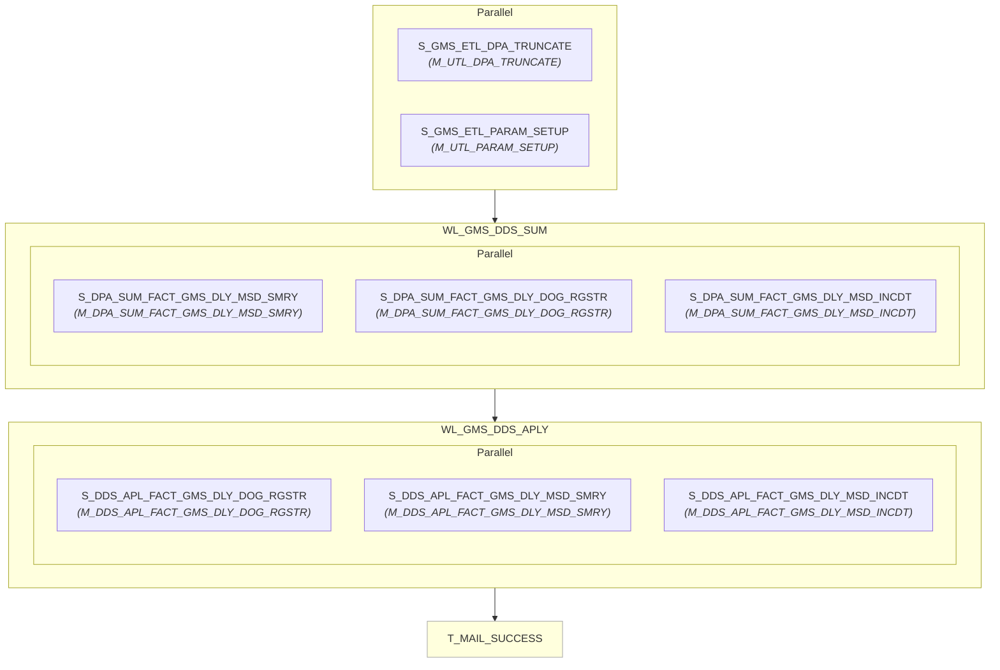

# WF_GMS_DDS_APLY_DLY

## Execution Flow

Auto-generated from Informatica PowerCenter workflow

## Session to Mapping

| Session | Mapping | Plan-Level |
|---------|---------|------------|
| S_GMS_ETL_DPA_TRUNCATE | M_UTL_DPA_TRUNCATE | Top-Level |
| S_GMS_ETL_PARAM_SETUP | M_UTL_PARAM_SETUP | Top-Level |
| S_DPA_SUM_FACT_GMS_DLY_MSD_SMRY | M_DPA_SUM_FACT_GMS_DLY_MSD_SMRY | Worklet: WL_GMS_DDS_SUM |
| S_DPA_SUM_FACT_GMS_DLY_DOG_RGSTR | M_DPA_SUM_FACT_GMS_DLY_DOG_RGSTR | Worklet: WL_GMS_DDS_SUM |
| S_DPA_SUM_FACT_GMS_DLY_MSD_INCDT | M_DPA_SUM_FACT_GMS_DLY_MSD_INCDT | Worklet: WL_GMS_DDS_SUM |
| S_DDS_APL_FACT_GMS_DLY_DOG_RGSTR | M_DDS_APL_FACT_GMS_DLY_DOG_RGSTR | Worklet: WL_GMS_DDS_APLY |
| S_DDS_APL_FACT_GMS_DLY_MSD_SMRY | M_DDS_APL_FACT_GMS_DLY_MSD_SMRY | Worklet: WL_GMS_DDS_APLY |
| S_DDS_APL_FACT_GMS_DLY_MSD_INCDT | M_DDS_APL_FACT_GMS_DLY_MSD_INCDT | Worklet: WL_GMS_DDS_APLY |
| T_MAIL_SUCCESS | - | Top-Level |