# WF_HOMES_DDS_APLY_DMNS

## Execution Flow

Auto-generated from Informatica PowerCenter workflow

```mermaid
flowchart TD
    n1["S_HOM_ETL_DPA_TRUNCATE<br/><i>(M_UTL_DPA_TRUNCATE)</i>"]
    n2["S_HOM_ETL_DDS_BKP_DELETE<br/><i>(M_HOM_ETL_DDS_BKP_DELETE)</i>"]
    n3["S_HOM_ETL_PARAM_SETUP<br/><i>(M_UTL_PARAM_SETUP)</i>"]
    subgraph pg4[Parallel]
        n1
        n2
        n3
    end
    n5["S_HOM_ETL_DDS_BKP_INSERT<br/><i>(M_HOM_ETL_DDS_BKP_INSERT)</i>"]
    n6["S_HOM_ETL_DDS_FACT_DELETE<br/><i>(M_HOM_ETL_DDS_FACT_DELETE)</i>"]
    n7["S_HOM_ETL_DDS_DMNS_DELETE_NONZERO<br/><i>(M_HOM_ETL_DDS_DMNS_DELETE)</i>"]
    subgraph wkl8["WL_HOMES_DPA_DMNS"]
    n9["S_DPA_SUMMARIZE_DMNS_KPI_SNSH_YEAR<br/><i>(M_DPA_SUMMARIZE_DMNS_KPI_SNSH_YEAR)</i>"]
    n10["S_DPA_SUMMARIZE_DMNS_PROJ<br/><i>(M_DPA_SUMMARIZE_DMNS_PROJ)</i>"]
    n11["S_DPA_SUMMARIZE_DMNS_CNTR_STG<br/><i>(M_DPA_SUMMARIZE_DMNS_CNTR_STG)</i>"]
    n12["S_DPA_SUMMARIZE_DMNS_PRCS_YEAR<br/><i>(M_DPA_SUMMARIZE_DMNS_PRCS_YEAR)</i>"]
    n13["S_DPA_SUMMARIZE_DMNS_KPI_SNSH_MTH<br/><i>(M_DPA_SUMMARIZE_DMNS_KPI_SNSH_MTH)</i>"]
    n14["S_DPA_SUMMARIZE_DMNS_BDGT_COPY<br/><i>(M_DPA_SUMMARIZE_DMNS_BDGT_COPY)</i>"]
    n15["S_DPA_SUMMARIZE_DMNS_DSTR_GRP<br/><i>(M_DPA_SUMMARIZE_DMNS_DSTR_GRP)</i>"]
    n16["S_DPA_SUMMARIZE_DMNS_BDGT_PROJ_STS<br/><i>(M_DPA_SUMMARIZE_DMNS_BDGT_PROJ_STS)</i>"]
    n17["S_DPA_SUMMARIZE_DMNS_SNSH_PROJ<br/><i>(M_DPA_SUMMARIZE_DMNS_SNSH_PROJ)</i>"]
    n18["S_DPA_SUMMARIZE_DMNS_CNTR_TYPE<br/><i>(M_DPA_SUMMARIZE_DMNS_CNTR_TYPE)</i>"]
    n19["S_DPA_SUMMARIZE_DMNS_SNSH_CNTR<br/><i>(M_DPA_SUMMARIZE_DMNS_SNSH_CNTR)</i>"]
    n20["S_DPA_SUMMARIZE_DMNS_FUND_NTR<br/><i>(M_DPA_SUMMARIZE_DMNS_FUND_NTR)</i>"]
    n21["S_DPA_SUMMARIZE_DMNS_DSTR<br/><i>(M_DPA_SUMMARIZE_DMNS_DSTR)</i>"]
    n22["S_DPA_SUMMARIZE_DMNS_KPI_TYPE<br/><i>(M_DPA_SUMMARIZE_DMNS_KPI_TYPE)</i>"]
    n23["S_DPA_SUMMARIZE_DMNS_PROJ_BLK_TYPE<br/><i>(M_DPA_SUMMARIZE_DMNS_PROJ_BLK_TYPE)</i>"]
    n24["S_DPA_SUMMARIZE_DMNS_PMC_DSTR<br/><i>(M_DPA_SUMMARIZE_DMNS_PMC_DSTR)</i>"]
    n25["S_DPA_SUMMARIZE_DMNS_BDGT_PRCS_YEAR<br/><i>(M_DPA_SUMMARIZE_DMNS_BDGT_PRCS_YEAR)</i>"]
    n26["S_DPA_SUMMARIZE_DMNS_PHCP<br/><i>(M_DPA_SUMMARIZE_DMNS_PHCP)</i>"]
    n27["S_DPA_SUMMARIZE_DMNS_FLATMIX<br/><i>(M_DPA_SUMMARIZE_DMNS_FLATMIX)</i>"]
    n28["S_DPA_SUMMARIZE_DMNS_CNTR_MGR<br/><i>(M_DPA_SUMMARIZE_DMNS_CNTR_MGR)</i>"]
    n29["S_DPA_SUMMARIZE_DMNS_CNTR<br/><i>(M_DPA_SUMMARIZE_DMNS_CNTR)</i>"]
    n30["S_DPA_SUMMARIZE_DMNS_PROJ_NTR<br/><i>(M_DPA_SUMMARIZE_DMNS_PROJ_NTR)</i>"]
    n31["S_DPA_SUMMARIZE_DMNS_FIN_NTR<br/><i>(M_DPA_SUMMARIZE_DMNS_FIN_NTR)</i>"]
    n32["S_DPA_SUMMARIZE_DMNS_BDGT_PROJ_MGR<br/><i>(M_DPA_SUMMARIZE_DMNS_BDGT_PROJ_MGR)</i>"]
    n33["S_DPA_SUMMARIZE_DMNS_SNSH<br/><i>(M_DPA_SUMMARIZE_DMNS_SNSH)</i>"]
    n34["S_DPA_SUMMARIZE_DMNS_VDR<br/><i>(M_DPA_SUMMARIZE_DMNS_VDR)</i>"]
    n35["S_DPA_SUMMARIZE_DMNS_RPT_CATG<br/><i>(M_DPA_SUMMARIZE_DMNS_RPT_CATG)</i>"]
    n36["S_DPA_SUMMARIZE_DMNS_PROJ_STG<br/><i>(M_DPA_SUMMARIZE_DMNS_PROJ_STG)</i>"]
    n37["S_DPA_SUMMARIZE_DMNS_MTH<br/><i>(M_DPA_SUMMARIZE_DMNS_MTH)</i>"]
    n38["S_DPA_SUMMARIZE_DMNS_ORG<br/><i>(M_DPA_SUMMARIZE_DMNS_ORG)</i>"]
    subgraph pg39[Parallel]
        n9
        n10
        n11
        n12
        n13
        n14
        n15
        n16
        n17
        n18
        n19
        n20
        n21
        n22
        n23
        n24
        n25
        n26
        n27
        n28
        n29
        n30
        n31
        n32
        n33
        n34
        n35
        n36
        n37
        n38
    end
    end
    subgraph wkl40["WL_HOMES_DDS_DMNS"]
    n41["S_DDS_APLY_DMNS_KPI_SNSH_MTH<br/><i>(M_DDS_APLY_DMNS_KPI_SNSH_MTH)</i>"]
    n42["S_DDS_APLY_DMNS_PROJ_BLK_TYPE<br/><i>(M_DDS_APLY_DMNS_PROJ_BLK_TYPE)</i>"]
    n43["S_DDS_APLY_DMNS_KPI_SNSH_YEAR<br/><i>(M_DDS_APLY_DMNS_KPI_SNSH_YEAR)</i>"]
    n44["S_DDS_APLY_DMNS_BDGT_PROJ_STS<br/><i>(M_DDS_APLY_DMNS_BDGT_PROJ_STS)</i>"]
    n45["S_DDS_APLY_DMNS_KPI_TYPE<br/><i>(M_DDS_APLY_DMNS_KPI_TYPE)</i>"]
    n46["S_DDS_APLY_DMNS_SNSH_CNTR<br/><i>(M_DDS_APLY_DMNS_SNSH_CNTR)</i>"]
    n47["S_DDS_APLY_DMNS_VDR<br/><i>(M_DDS_APLY_DMNS_VDR)</i>"]
    n48["S_DDS_APLY_DMNS_FLATMIX<br/><i>(M_DDS_APLY_DMNS_FLATMIX)</i>"]
    n49["S_DDS_APLY_DMNS_PMC_DSTR<br/><i>(M_DDS_APLY_DMNS_PMC_DSTR)</i>"]
    n50["S_DDS_APLY_DMNS_PROJ<br/><i>(M_DDS_APLY_DMNS_PROJ)</i>"]
    n51["S_DDS_APLY_DMNS_PROJ_NTR<br/><i>(M_DDS_APLY_DMNS_PROJ_NTR)</i>"]
    n52["S_DDS_APLY_DMNS_RPT_CATG<br/><i>(M_DDS_APLY_DMNS_RPT_CATG)</i>"]
    n53["S_DDS_APLY_DMNS_ORG<br/><i>(M_DDS_APLY_DMNS_ORG)</i>"]
    n54["S_DDS_APLY_DMNS_PROJ_STG<br/><i>(M_DDS_APLY_DMNS_PROJ_STG)</i>"]
    n55["S_DDS_APLY_DMNS_BDGT_PROJ_MGR<br/><i>(M_DDS_APLY_DMNS_BDGT_PROJ_MGR)</i>"]
    n56["S_DDS_APLY_DMNS_CNTR_MGR<br/><i>(M_DDS_APLY_DMNS_CNTR_MGR)</i>"]
    n57["S_DDS_APLY_DMNS_SNSH_PROJ<br/><i>(M_DDS_APLY_DMNS_SNSH_PROJ)</i>"]
    n58["S_DDS_APLY_DMNS_MTH<br/><i>(M_DDS_APLY_DMNS_MTH)</i>"]
    n59["S_DDS_APLY_DMNS_CNTR_TYPE<br/><i>(M_DDS_APLY_DMNS_CNTR_TYPE)</i>"]
    n60["S_DDS_APLY_DMNS_CNTR_STG<br/><i>(M_DDS_APLY_DMNS_CNTR_STG)</i>"]
    n61["S_DDS_APLY_DMNS_FUND_NTR<br/><i>(M_DDS_APLY_DMNS_FUND_NTR)</i>"]
    n62["S_DDS_APLY_DMNS_DSTR<br/><i>(M_DDS_APLY_DMNS_DSTR)</i>"]
    n63["S_DDS_APLY_DMNS_PRCS_YEAR<br/><i>(M_DDS_APLY_DMNS_PRCS_YEAR)</i>"]
    n64["S_DDS_APLY_DMNS_PHCP<br/><i>(M_DDS_APLY_DMNS_PHCP)</i>"]
    n65["S_DDS_APLY_DMNS_DSTR_GRP<br/><i>(M_DDS_APLY_DMNS_DSTR_GRP)</i>"]
    n66["S_DDS_APLY_DMNS_CNTR<br/><i>(M_DDS_APLY_DMNS_CNTR)</i>"]
    n67["S_DDS_APLY_DMNS_BDGT_COPY<br/><i>(M_DDS_APLY_DMNS_BDGT_COPY)</i>"]
    n68["S_DDS_APLY_DMNS_BDGT_PRCS_YEAR<br/><i>(M_DDS_APLY_DMNS_BDGT_PRCS_YEAR)</i>"]
    n69["S_DDS_APLY_DMNS_SNSH<br/><i>(M_DDS_APLY_DMNS_SNSH)</i>"]
    n70["S_DDS_APLY_DMNS_FIN_NTR<br/><i>(M_DDS_APLY_DMNS_FIN_NTR)</i>"]
    subgraph pg71[Parallel]
        n41
        n42
        n43
        n44
        n45
        n46
        n47
        n48
        n49
        n50
        n51
        n52
        n53
        n54
        n55
        n56
        n57
        n58
        n59
        n60
        n61
        n62
        n63
        n64
        n65
        n66
        n67
        n68
        n69
        n70
    end
    end
    n72["T_MAIL_SUCCESS"]
    style n72 fill:#ffd,stroke:#aaa,stroke-width:1px
    n73["S_HOM_ELT_DDS_DMNS_DELETE<br/><i>(M_HOM_ETL_DDS_DMNS_DELETE)</i>"]
    subgraph pg74[Parallel]
        n72
        n73
    end
    n75["S_HOM_ETL_DDS_RECOVERY<br/><i>(M_HOM_ETL_DDS_RECOVERY)</i>"]
    pg4 --> n5
    n5 --> n6
    n6 --> n7
    n7 --> wkl8
    wkl8 --> wkl40
    wkl40 --> pg74
    pg74 --> n75
```

## Session to Mapping

| Session | Mapping | Plan-Level |
|---------|---------|------------|
| S_HOM_ETL_DPA_TRUNCATE | M_UTL_DPA_TRUNCATE | Top-Level |
| S_HOM_ETL_DDS_BKP_DELETE | M_HOM_ETL_DDS_BKP_DELETE | Top-Level |
| S_HOM_ETL_PARAM_SETUP | M_UTL_PARAM_SETUP | Top-Level |
| S_HOM_ETL_DDS_BKP_INSERT | M_HOM_ETL_DDS_BKP_INSERT | Top-Level |
| S_HOM_ETL_DDS_FACT_DELETE | M_HOM_ETL_DDS_FACT_DELETE | Top-Level |
| S_HOM_ETL_DDS_DMNS_DELETE_NONZERO | M_HOM_ETL_DDS_DMNS_DELETE | Top-Level |
| S_DPA_SUMMARIZE_DMNS_KPI_SNSH_YEAR | M_DPA_SUMMARIZE_DMNS_KPI_SNSH_YEAR | Worklet: WL_HOMES_DPA_DMNS |
| S_DPA_SUMMARIZE_DMNS_PROJ | M_DPA_SUMMARIZE_DMNS_PROJ | Worklet: WL_HOMES_DPA_DMNS |
| S_DPA_SUMMARIZE_DMNS_CNTR_STG | M_DPA_SUMMARIZE_DMNS_CNTR_STG | Worklet: WL_HOMES_DPA_DMNS |
| S_DPA_SUMMARIZE_DMNS_PRCS_YEAR | M_DPA_SUMMARIZE_DMNS_PRCS_YEAR | Worklet: WL_HOMES_DPA_DMNS |
| S_DPA_SUMMARIZE_DMNS_KPI_SNSH_MTH | M_DPA_SUMMARIZE_DMNS_KPI_SNSH_MTH | Worklet: WL_HOMES_DPA_DMNS |
| S_DPA_SUMMARIZE_DMNS_BDGT_COPY | M_DPA_SUMMARIZE_DMNS_BDGT_COPY | Worklet: WL_HOMES_DPA_DMNS |
| S_DPA_SUMMARIZE_DMNS_DSTR_GRP | M_DPA_SUMMARIZE_DMNS_DSTR_GRP | Worklet: WL_HOMES_DPA_DMNS |
| S_DPA_SUMMARIZE_DMNS_BDGT_PROJ_STS | M_DPA_SUMMARIZE_DMNS_BDGT_PROJ_STS | Worklet: WL_HOMES_DPA_DMNS |
| S_DPA_SUMMARIZE_DMNS_SNSH_PROJ | M_DPA_SUMMARIZE_DMNS_SNSH_PROJ | Worklet: WL_HOMES_DPA_DMNS |
| S_DPA_SUMMARIZE_DMNS_CNTR_TYPE | M_DPA_SUMMARIZE_DMNS_CNTR_TYPE | Worklet: WL_HOMES_DPA_DMNS |
| S_DPA_SUMMARIZE_DMNS_SNSH_CNTR | M_DPA_SUMMARIZE_DMNS_SNSH_CNTR | Worklet: WL_HOMES_DPA_DMNS |
| S_DPA_SUMMARIZE_DMNS_FUND_NTR | M_DPA_SUMMARIZE_DMNS_FUND_NTR | Worklet: WL_HOMES_DPA_DMNS |
| S_DPA_SUMMARIZE_DMNS_DSTR | M_DPA_SUMMARIZE_DMNS_DSTR | Worklet: WL_HOMES_DPA_DMNS |
| S_DPA_SUMMARIZE_DMNS_KPI_TYPE | M_DPA_SUMMARIZE_DMNS_KPI_TYPE | Worklet: WL_HOMES_DPA_DMNS |
| S_DPA_SUMMARIZE_DMNS_PROJ_BLK_TYPE | M_DPA_SUMMARIZE_DMNS_PROJ_BLK_TYPE | Worklet: WL_HOMES_DPA_DMNS |
| S_DPA_SUMMARIZE_DMNS_PMC_DSTR | M_DPA_SUMMARIZE_DMNS_PMC_DSTR | Worklet: WL_HOMES_DPA_DMNS |
| S_DPA_SUMMARIZE_DMNS_BDGT_PRCS_YEAR | M_DPA_SUMMARIZE_DMNS_BDGT_PRCS_YEAR | Worklet: WL_HOMES_DPA_DMNS |
| S_DPA_SUMMARIZE_DMNS_PHCP | M_DPA_SUMMARIZE_DMNS_PHCP | Worklet: WL_HOMES_DPA_DMNS |
| S_DPA_SUMMARIZE_DMNS_FLATMIX | M_DPA_SUMMARIZE_DMNS_FLATMIX | Worklet: WL_HOMES_DPA_DMNS |
| S_DPA_SUMMARIZE_DMNS_CNTR_MGR | M_DPA_SUMMARIZE_DMNS_CNTR_MGR | Worklet: WL_HOMES_DPA_DMNS |
| S_DPA_SUMMARIZE_DMNS_CNTR | M_DPA_SUMMARIZE_DMNS_CNTR | Worklet: WL_HOMES_DPA_DMNS |
| S_DPA_SUMMARIZE_DMNS_PROJ_NTR | M_DPA_SUMMARIZE_DMNS_PROJ_NTR | Worklet: WL_HOMES_DPA_DMNS |
| S_DPA_SUMMARIZE_DMNS_FIN_NTR | M_DPA_SUMMARIZE_DMNS_FIN_NTR | Worklet: WL_HOMES_DPA_DMNS |
| S_DPA_SUMMARIZE_DMNS_BDGT_PROJ_MGR | M_DPA_SUMMARIZE_DMNS_BDGT_PROJ_MGR | Worklet: WL_HOMES_DPA_DMNS |
| S_DPA_SUMMARIZE_DMNS_SNSH | M_DPA_SUMMARIZE_DMNS_SNSH | Worklet: WL_HOMES_DPA_DMNS |
| S_DPA_SUMMARIZE_DMNS_VDR | M_DPA_SUMMARIZE_DMNS_VDR | Worklet: WL_HOMES_DPA_DMNS |
| S_DPA_SUMMARIZE_DMNS_RPT_CATG | M_DPA_SUMMARIZE_DMNS_RPT_CATG | Worklet: WL_HOMES_DPA_DMNS |
| S_DPA_SUMMARIZE_DMNS_PROJ_STG | M_DPA_SUMMARIZE_DMNS_PROJ_STG | Worklet: WL_HOMES_DPA_DMNS |
| S_DPA_SUMMARIZE_DMNS_MTH | M_DPA_SUMMARIZE_DMNS_MTH | Worklet: WL_HOMES_DPA_DMNS |
| S_DPA_SUMMARIZE_DMNS_ORG | M_DPA_SUMMARIZE_DMNS_ORG | Worklet: WL_HOMES_DPA_DMNS |
| S_DDS_APLY_DMNS_KPI_SNSH_MTH | M_DDS_APLY_DMNS_KPI_SNSH_MTH | Worklet: WL_HOMES_DDS_DMNS |
| S_DDS_APLY_DMNS_PROJ_BLK_TYPE | M_DDS_APLY_DMNS_PROJ_BLK_TYPE | Worklet: WL_HOMES_DDS_DMNS |
| S_DDS_APLY_DMNS_KPI_SNSH_YEAR | M_DDS_APLY_DMNS_KPI_SNSH_YEAR | Worklet: WL_HOMES_DDS_DMNS |
| S_DDS_APLY_DMNS_BDGT_PROJ_STS | M_DDS_APLY_DMNS_BDGT_PROJ_STS | Worklet: WL_HOMES_DDS_DMNS |
| S_DDS_APLY_DMNS_KPI_TYPE | M_DDS_APLY_DMNS_KPI_TYPE | Worklet: WL_HOMES_DDS_DMNS |
| S_DDS_APLY_DMNS_SNSH_CNTR | M_DDS_APLY_DMNS_SNSH_CNTR | Worklet: WL_HOMES_DDS_DMNS |
| S_DDS_APLY_DMNS_VDR | M_DDS_APLY_DMNS_VDR | Worklet: WL_HOMES_DDS_DMNS |
| S_DDS_APLY_DMNS_FLATMIX | M_DDS_APLY_DMNS_FLATMIX | Worklet: WL_HOMES_DDS_DMNS |
| S_DDS_APLY_DMNS_PMC_DSTR | M_DDS_APLY_DMNS_PMC_DSTR | Worklet: WL_HOMES_DDS_DMNS |
| S_DDS_APLY_DMNS_PROJ | M_DDS_APLY_DMNS_PROJ | Worklet: WL_HOMES_DDS_DMNS |
| S_DDS_APLY_DMNS_PROJ_NTR | M_DDS_APLY_DMNS_PROJ_NTR | Worklet: WL_HOMES_DDS_DMNS |
| S_DDS_APLY_DMNS_RPT_CATG | M_DDS_APLY_DMNS_RPT_CATG | Worklet: WL_HOMES_DDS_DMNS |
| S_DDS_APLY_DMNS_ORG | M_DDS_APLY_DMNS_ORG | Worklet: WL_HOMES_DDS_DMNS |
| S_DDS_APLY_DMNS_PROJ_STG | M_DDS_APLY_DMNS_PROJ_STG | Worklet: WL_HOMES_DDS_DMNS |
| S_DDS_APLY_DMNS_BDGT_PROJ_MGR | M_DDS_APLY_DMNS_BDGT_PROJ_MGR | Worklet: WL_HOMES_DDS_DMNS |
| S_DDS_APLY_DMNS_CNTR_MGR | M_DDS_APLY_DMNS_CNTR_MGR | Worklet: WL_HOMES_DDS_DMNS |
| S_DDS_APLY_DMNS_SNSH_PROJ | M_DDS_APLY_DMNS_SNSH_PROJ | Worklet: WL_HOMES_DDS_DMNS |
| S_DDS_APLY_DMNS_MTH | M_DDS_APLY_DMNS_MTH | Worklet: WL_HOMES_DDS_DMNS |
| S_DDS_APLY_DMNS_CNTR_TYPE | M_DDS_APLY_DMNS_CNTR_TYPE | Worklet: WL_HOMES_DDS_DMNS |
| S_DDS_APLY_DMNS_CNTR_STG | M_DDS_APLY_DMNS_CNTR_STG | Worklet: WL_HOMES_DDS_DMNS |
| S_DDS_APLY_DMNS_FUND_NTR | M_DDS_APLY_DMNS_FUND_NTR | Worklet: WL_HOMES_DDS_DMNS |
| S_DDS_APLY_DMNS_DSTR | M_DDS_APLY_DMNS_DSTR | Worklet: WL_HOMES_DDS_DMNS |
| S_DDS_APLY_DMNS_PRCS_YEAR | M_DDS_APLY_DMNS_PRCS_YEAR | Worklet: WL_HOMES_DDS_DMNS |
| S_DDS_APLY_DMNS_PHCP | M_DDS_APLY_DMNS_PHCP | Worklet: WL_HOMES_DDS_DMNS |
| S_DDS_APLY_DMNS_DSTR_GRP | M_DDS_APLY_DMNS_DSTR_GRP | Worklet: WL_HOMES_DDS_DMNS |
| S_DDS_APLY_DMNS_CNTR | M_DDS_APLY_DMNS_CNTR | Worklet: WL_HOMES_DDS_DMNS |
| S_DDS_APLY_DMNS_BDGT_COPY | M_DDS_APLY_DMNS_BDGT_COPY | Worklet: WL_HOMES_DDS_DMNS |
| S_DDS_APLY_DMNS_BDGT_PRCS_YEAR | M_DDS_APLY_DMNS_BDGT_PRCS_YEAR | Worklet: WL_HOMES_DDS_DMNS |
| S_DDS_APLY_DMNS_SNSH | M_DDS_APLY_DMNS_SNSH | Worklet: WL_HOMES_DDS_DMNS |
| S_DDS_APLY_DMNS_FIN_NTR | M_DDS_APLY_DMNS_FIN_NTR | Worklet: WL_HOMES_DDS_DMNS |
| T_MAIL_SUCCESS | - | Top-Level |
| S_HOM_ELT_DDS_DMNS_DELETE | M_HOM_ETL_DDS_DMNS_DELETE | Top-Level |
| S_HOM_ETL_DDS_RECOVERY | M_HOM_ETL_DDS_RECOVERY | Top-Level |