# WF_NHS_EX

## Execution Flow

Auto-generated from Informatica PowerCenter workflow

```mermaid
flowchart TD
    n1["S_NHS_ETL_SSA_TRUNCATE<br/><i>(M_UTL_SSA_TRUNCATE)</i>"]
    n2["S_NHS_SETUP_UTL<br/><i>(M_NHS_SETUP_UTL)</i>"]
    subgraph pg3[Parallel]
        n1
        n2
    end
    n4["S_NHS_ETL_PARAM_SETUP<br/><i>(M_UTL_PARAM_SETUP)</i>"]
    subgraph wkl5["WL_NHS_SSAL1_EXTR"]
    n6["S_NHS_SSAL1_EXTR_NHS_HSE_RGN<br/><i>(M_NHS_SSAL1_EXTR_NHS_HSE_RGN)</i>"]
    n7["S_NHS_SSAL1_EXTR_NHS_DUP_CHK_RSLT<br/><i>(M_NHS_SSAL1_EXTR_NHS_DUP_CHK_RSLT)</i>"]
    n8["S_NHS_SSAL1_EXTR_NHS_PCHS_STL<br/><i>(M_NHS_SSAL1_EXTR_NHS_PCHS_STL)</i>"]
    n9["S_NHS_SSAL1_EXTR_NHS_RSCN_PCHS_STL<br/><i>(M_NHS_SSAL1_EXTR_NHS_RSCN_PCHS_STL)</i>"]
    n10["S_NHS_SSAL1_EXTR_NHS_FLAT_SLCT_QUE<br/><i>(M_NHS_SSAL1_EXTR_NHS_FLAT_SLCT_QUE)</i>"]
    n11["S_NHS_SSAL1_EXTR_NHS_PHASE_FLAT_ORNT<br/><i>(M_NHS_SSAL1_EXTR_NHS_PHASE_FLAT_ORNT)</i>"]
    n12["S_NHS_SSAL1_EXTR_NHS_FLAT_SLCT_SSN<br/><i>(M_NHS_SSAL1_EXTR_NHS_FLAT_SLCT_SSN)</i>"]
    n13["S_NHS_SSAL1_EXTR_NHS_HOS_APLY_BLT<br/><i>(M_NHS_SSAL1_EXTR_NHS_HOS_APLY_BLT)</i>"]
    n14["S_NHS_SSAL1_EXTR_NHS_FLAT_SLCT_SSN_ASGN<br/><i>(M_NHS_SSAL1_EXTR_NHS_FLAT_SLCT_SSN_ASGN)</i>"]
    n15["S_NHS_SSAL1_EXTR_NHS_RVN_TXN<br/><i>(M_NHS_SSAL1_EXTR_NHS_RVN_TXN)</i>"]
    n16["S_NHS_SSAL1_EXTR_NHS_PHASE_ASP<br/><i>(M_NHS_SSAL1_EXTR_NHS_PHASE_ASP)</i>"]
    n17["S_NHS_SSAL1_EXTR_NHS_FLAT_SLCT_STMT<br/><i>(M_NHS_SSAL1_EXTR_NHS_FLAT_SLCT_STMT)</i>"]
    n18["S_NHS_SSAL1_EXTR_NHS_ADTN_APLY_INFO<br/><i>(M_NHS_SSAL1_EXTR_NHS_ADTN_APLY_INFO)</i>"]
    n19["S_NHS_SSAL1_EXTR_NHS_RVN_TXN_ITEM<br/><i>(M_NHS_SSAL1_EXTR_NHS_RVN_TXN_ITEM)</i>"]
    n20["S_NHS_SSAL1_EXTR_NHS_PHASE<br/><i>(M_NHS_SSAL1_EXTR_NHS_PHASE)</i>"]
    n21["S_NHS_SSAL1_EXTR_NHS_EST_BANK<br/><i>(M_NHS_SSAL1_EXTR_NHS_EST_BANK)</i>"]
    n22["S_NHS_SSAL1_EXTR_NHS_EST_BANK_ITEM<br/><i>(M_NHS_SSAL1_EXTR_NHS_EST_BANK_ITEM)</i>"]
    n23["S_NHS_SSAL1_EXTR_NHS_HOS_APLY_REJ_RSN<br/><i>(M_NHS_SSAL1_EXTR_NHS_HOS_APLY_REJ_RSN)</i>"]
    n24["S_NHS_SSAL1_EXTR_NHS_HOS_APLY_MBR<br/><i>(M_NHS_SSAL1_EXTR_NHS_HOS_APLY_MBR)</i>"]
    n25["S_NHS_SSAL1_EXTR_NHS_RVN_CLCT_TRML<br/><i>(M_NHS_SSAL1_EXTR_NHS_RVN_CLCT_TRML)</i>"]
    n26["S_NHS_SSAL1_EXTR_NHS_HOS_CRT<br/><i>(M_NHS_SSAL1_EXTR_NHS_HOS_CRT)</i>"]
    n27["S_NHS_SSAL1_EXTR_NHS_INTVW_SCHD<br/><i>(M_NHS_SSAL1_EXTR_NHS_INTVW_SCHD)</i>"]
    n28["S_NHS_SSAL1_EXTR_NHS_RSRV_FLAT<br/><i>(M_NHS_SSAL1_EXTR_NHS_RSRV_FLAT)</i>"]
    n29["S_NHS_SSAL1_EXTR_NHS_PCHS_STL_PYMT_SCHD<br/><i>(M_NHS_SSAL1_EXTR_NHS_PCHS_STL_PYMT_SCHD)</i>"]
    n30["S_NHS_SSAL1_EXTR_NHS_HSE_DSTR<br/><i>(M_NHS_SSAL1_EXTR_NHS_HSE_DSTR)</i>"]
    n31["S_NHS_SSAL1_EXTR_NHS_HOS_OWN_MBR_PTCL<br/><i>(M_NHS_SSAL1_EXTR_NHS_HOS_OWN_MBR_PTCL)</i>"]
    n32["S_NHS_SSAL1_EXTR_NHS_APLY_VET_RSLT<br/><i>(M_NHS_SSAL1_EXTR_NHS_APLY_VET_RSLT)</i>"]
    n33["S_NHS_SSAL1_EXTR_NHS_HOS_APLY_CATG_PRIOR<br/><i>(M_NHS_SSAL1_EXTR_NHS_HOS_APLY_CATG_PRIOR)</i>"]
    n34["S_NHS_SSAL1_EXTR_NHS_PHASE_FLAT<br/><i>(M_NHS_SSAL1_EXTR_NHS_PHASE_FLAT)</i>"]
    n35["S_NHS_SSAL1_EXTR_NHS_PHASE_BLT<br/><i>(M_NHS_SSAL1_EXTR_NHS_PHASE_BLT)</i>"]
    n36["S_NHS_SSAL1_EXTR_NHS_RVN_TXN_PYMT<br/><i>(M_NHS_SSAL1_EXTR_NHS_RVN_TXN_PYMT)</i>"]
    n37["S_NHS_SSAL1_EXTR_NHS_PRIOR_CATG_GRP<br/><i>(M_NHS_SSAL1_EXTR_NHS_PRIOR_CATG_GRP)</i>"]
    n38["S_NHS_SSAL1_EXTR_NHS_HOS_OWN<br/><i>(M_NHS_SSAL1_EXTR_NHS_HOS_OWN)</i>"]
    n39["S_NHS_SSAL1_EXTR_NHS_HOS_BLK<br/><i>(M_NHS_SSAL1_EXTR_NHS_HOS_BLK)</i>"]
    n40["S_NHS_SSAL1_EXTR_NHS_PCHS_STL_WVE_INTRST<br/><i>(M_NHS_SSAL1_EXTR_NHS_PCHS_STL_WVE_INTRST)</i>"]
    n41["S_NHS_SSAL1_EXTR_NHS_RVN_CLCT_OFFC<br/><i>(M_NHS_SSAL1_EXTR_NHS_RVN_CLCT_OFFC)</i>"]
    n42["S_NHS_SSAL1_EXTR_NHS_HOS_APLY<br/><i>(M_NHS_SSAL1_EXTR_NHS_HOS_APLY)</i>"]
    n43["S_NHS_SSAL1_EXTR_NHS_HOS_FLAT<br/><i>(M_NHS_SSAL1_EXTR_NHS_HOS_FLAT)</i>"]
    n44["S_NHS_SSAL1_EXTR_NHS_REF_CODE<br/><i>(M_NHS_SSAL1_EXTR_NHS_REF_CODE)</i>"]
    n45["S_NHS_SSAL1_EXTR_NHS_REF_CODE_TYPE<br/><i>(M_NHS_SSAL1_EXTR_NHS_REF_CODE_TYPE)</i>"]
    n46["S_NHS_SSAL1_EXTR_NHS_FLAT_SLCT<br/><i>(M_NHS_SSAL1_EXTR_NHS_FLAT_SLCT)</i>"]
    n47["S_NHS_SSAL1_EXTR_NHS_PHASE_CRT<br/><i>(M_NHS_SSAL1_EXTR_NHS_PHASE_CRT)</i>"]
    n48["S_NHS_SSAL1_EXTR_NHS_RVN_ITEM_TYPE<br/><i>(M_NHS_SSAL1_EXTR_NHS_RVN_ITEM_TYPE)</i>"]
    subgraph pg49[Parallel]
        n6
        n7
        n8
        n9
        n10
        n11
        n12
        n13
        n14
        n15
        n16
        n17
        n18
        n19
        n20
        n21
        n22
        n23
        n24
        n25
        n26
        n27
        n28
        n29
        n30
        n31
        n32
        n33
        n34
        n35
        n36
        n37
        n38
        n39
        n40
        n41
        n42
        n43
        n44
        n45
        n46
        n47
        n48
    end
    end
    n50["T_MAIL_SUCCESS"]
    style n50 fill:#ffd,stroke:#aaa,stroke-width:1px
    pg3 --> n4
    n4 --> wkl5
    wkl5 --> n50
```

## Session to Mapping

| Session | Mapping | Plan-Level |
|---------|---------|------------|
| S_NHS_ETL_SSA_TRUNCATE | M_UTL_SSA_TRUNCATE | Top-Level |
| S_NHS_SETUP_UTL | M_NHS_SETUP_UTL | Top-Level |
| S_NHS_ETL_PARAM_SETUP | M_UTL_PARAM_SETUP | Top-Level |
| S_NHS_SSAL1_EXTR_NHS_HSE_RGN | M_NHS_SSAL1_EXTR_NHS_HSE_RGN | Worklet: WL_NHS_SSAL1_EXTR |
| S_NHS_SSAL1_EXTR_NHS_DUP_CHK_RSLT | M_NHS_SSAL1_EXTR_NHS_DUP_CHK_RSLT | Worklet: WL_NHS_SSAL1_EXTR |
| S_NHS_SSAL1_EXTR_NHS_PCHS_STL | M_NHS_SSAL1_EXTR_NHS_PCHS_STL | Worklet: WL_NHS_SSAL1_EXTR |
| S_NHS_SSAL1_EXTR_NHS_RSCN_PCHS_STL | M_NHS_SSAL1_EXTR_NHS_RSCN_PCHS_STL | Worklet: WL_NHS_SSAL1_EXTR |
| S_NHS_SSAL1_EXTR_NHS_FLAT_SLCT_QUE | M_NHS_SSAL1_EXTR_NHS_FLAT_SLCT_QUE | Worklet: WL_NHS_SSAL1_EXTR |
| S_NHS_SSAL1_EXTR_NHS_PHASE_FLAT_ORNT | M_NHS_SSAL1_EXTR_NHS_PHASE_FLAT_ORNT | Worklet: WL_NHS_SSAL1_EXTR |
| S_NHS_SSAL1_EXTR_NHS_FLAT_SLCT_SSN | M_NHS_SSAL1_EXTR_NHS_FLAT_SLCT_SSN | Worklet: WL_NHS_SSAL1_EXTR |
| S_NHS_SSAL1_EXTR_NHS_HOS_APLY_BLT | M_NHS_SSAL1_EXTR_NHS_HOS_APLY_BLT | Worklet: WL_NHS_SSAL1_EXTR |
| S_NHS_SSAL1_EXTR_NHS_FLAT_SLCT_SSN_ASGN | M_NHS_SSAL1_EXTR_NHS_FLAT_SLCT_SSN_ASGN | Worklet: WL_NHS_SSAL1_EXTR |
| S_NHS_SSAL1_EXTR_NHS_RVN_TXN | M_NHS_SSAL1_EXTR_NHS_RVN_TXN | Worklet: WL_NHS_SSAL1_EXTR |
| S_NHS_SSAL1_EXTR_NHS_PHASE_ASP | M_NHS_SSAL1_EXTR_NHS_PHASE_ASP | Worklet: WL_NHS_SSAL1_EXTR |
| S_NHS_SSAL1_EXTR_NHS_FLAT_SLCT_STMT | M_NHS_SSAL1_EXTR_NHS_FLAT_SLCT_STMT | Worklet: WL_NHS_SSAL1_EXTR |
| S_NHS_SSAL1_EXTR_NHS_ADTN_APLY_INFO | M_NHS_SSAL1_EXTR_NHS_ADTN_APLY_INFO | Worklet: WL_NHS_SSAL1_EXTR |
| S_NHS_SSAL1_EXTR_NHS_RVN_TXN_ITEM | M_NHS_SSAL1_EXTR_NHS_RVN_TXN_ITEM | Worklet: WL_NHS_SSAL1_EXTR |
| S_NHS_SSAL1_EXTR_NHS_PHASE | M_NHS_SSAL1_EXTR_NHS_PHASE | Worklet: WL_NHS_SSAL1_EXTR |
| S_NHS_SSAL1_EXTR_NHS_EST_BANK | M_NHS_SSAL1_EXTR_NHS_EST_BANK | Worklet: WL_NHS_SSAL1_EXTR |
| S_NHS_SSAL1_EXTR_NHS_EST_BANK_ITEM | M_NHS_SSAL1_EXTR_NHS_EST_BANK_ITEM | Worklet: WL_NHS_SSAL1_EXTR |
| S_NHS_SSAL1_EXTR_NHS_HOS_APLY_REJ_RSN | M_NHS_SSAL1_EXTR_NHS_HOS_APLY_REJ_RSN | Worklet: WL_NHS_SSAL1_EXTR |
| S_NHS_SSAL1_EXTR_NHS_HOS_APLY_MBR | M_NHS_SSAL1_EXTR_NHS_HOS_APLY_MBR | Worklet: WL_NHS_SSAL1_EXTR |
| S_NHS_SSAL1_EXTR_NHS_RVN_CLCT_TRML | M_NHS_SSAL1_EXTR_NHS_RVN_CLCT_TRML | Worklet: WL_NHS_SSAL1_EXTR |
| S_NHS_SSAL1_EXTR_NHS_HOS_CRT | M_NHS_SSAL1_EXTR_NHS_HOS_CRT | Worklet: WL_NHS_SSAL1_EXTR |
| S_NHS_SSAL1_EXTR_NHS_INTVW_SCHD | M_NHS_SSAL1_EXTR_NHS_INTVW_SCHD | Worklet: WL_NHS_SSAL1_EXTR |
| S_NHS_SSAL1_EXTR_NHS_RSRV_FLAT | M_NHS_SSAL1_EXTR_NHS_RSRV_FLAT | Worklet: WL_NHS_SSAL1_EXTR |
| S_NHS_SSAL1_EXTR_NHS_PCHS_STL_PYMT_SCHD | M_NHS_SSAL1_EXTR_NHS_PCHS_STL_PYMT_SCHD | Worklet: WL_NHS_SSAL1_EXTR |
| S_NHS_SSAL1_EXTR_NHS_HSE_DSTR | M_NHS_SSAL1_EXTR_NHS_HSE_DSTR | Worklet: WL_NHS_SSAL1_EXTR |
| S_NHS_SSAL1_EXTR_NHS_HOS_OWN_MBR_PTCL | M_NHS_SSAL1_EXTR_NHS_HOS_OWN_MBR_PTCL | Worklet: WL_NHS_SSAL1_EXTR |
| S_NHS_SSAL1_EXTR_NHS_APLY_VET_RSLT | M_NHS_SSAL1_EXTR_NHS_APLY_VET_RSLT | Worklet: WL_NHS_SSAL1_EXTR |
| S_NHS_SSAL1_EXTR_NHS_HOS_APLY_CATG_PRIOR | M_NHS_SSAL1_EXTR_NHS_HOS_APLY_CATG_PRIOR | Worklet: WL_NHS_SSAL1_EXTR |
| S_NHS_SSAL1_EXTR_NHS_PHASE_FLAT | M_NHS_SSAL1_EXTR_NHS_PHASE_FLAT | Worklet: WL_NHS_SSAL1_EXTR |
| S_NHS_SSAL1_EXTR_NHS_PHASE_BLT | M_NHS_SSAL1_EXTR_NHS_PHASE_BLT | Worklet: WL_NHS_SSAL1_EXTR |
| S_NHS_SSAL1_EXTR_NHS_RVN_TXN_PYMT | M_NHS_SSAL1_EXTR_NHS_RVN_TXN_PYMT | Worklet: WL_NHS_SSAL1_EXTR |
| S_NHS_SSAL1_EXTR_NHS_PRIOR_CATG_GRP | M_NHS_SSAL1_EXTR_NHS_PRIOR_CATG_GRP | Worklet: WL_NHS_SSAL1_EXTR |
| S_NHS_SSAL1_EXTR_NHS_HOS_OWN | M_NHS_SSAL1_EXTR_NHS_HOS_OWN | Worklet: WL_NHS_SSAL1_EXTR |
| S_NHS_SSAL1_EXTR_NHS_HOS_BLK | M_NHS_SSAL1_EXTR_NHS_HOS_BLK | Worklet: WL_NHS_SSAL1_EXTR |
| S_NHS_SSAL1_EXTR_NHS_PCHS_STL_WVE_INTRST | M_NHS_SSAL1_EXTR_NHS_PCHS_STL_WVE_INTRST | Worklet: WL_NHS_SSAL1_EXTR |
| S_NHS_SSAL1_EXTR_NHS_RVN_CLCT_OFFC | M_NHS_SSAL1_EXTR_NHS_RVN_CLCT_OFFC | Worklet: WL_NHS_SSAL1_EXTR |
| S_NHS_SSAL1_EXTR_NHS_HOS_APLY | M_NHS_SSAL1_EXTR_NHS_HOS_APLY | Worklet: WL_NHS_SSAL1_EXTR |
| S_NHS_SSAL1_EXTR_NHS_HOS_FLAT | M_NHS_SSAL1_EXTR_NHS_HOS_FLAT | Worklet: WL_NHS_SSAL1_EXTR |
| S_NHS_SSAL1_EXTR_NHS_REF_CODE | M_NHS_SSAL1_EXTR_NHS_REF_CODE | Worklet: WL_NHS_SSAL1_EXTR |
| S_NHS_SSAL1_EXTR_NHS_REF_CODE_TYPE | M_NHS_SSAL1_EXTR_NHS_REF_CODE_TYPE | Worklet: WL_NHS_SSAL1_EXTR |
| S_NHS_SSAL1_EXTR_NHS_FLAT_SLCT | M_NHS_SSAL1_EXTR_NHS_FLAT_SLCT | Worklet: WL_NHS_SSAL1_EXTR |
| S_NHS_SSAL1_EXTR_NHS_PHASE_CRT | M_NHS_SSAL1_EXTR_NHS_PHASE_CRT | Worklet: WL_NHS_SSAL1_EXTR |
| S_NHS_SSAL1_EXTR_NHS_RVN_ITEM_TYPE | M_NHS_SSAL1_EXTR_NHS_RVN_ITEM_TYPE | Worklet: WL_NHS_SSAL1_EXTR |
| T_MAIL_SUCCESS | - | Top-Level |