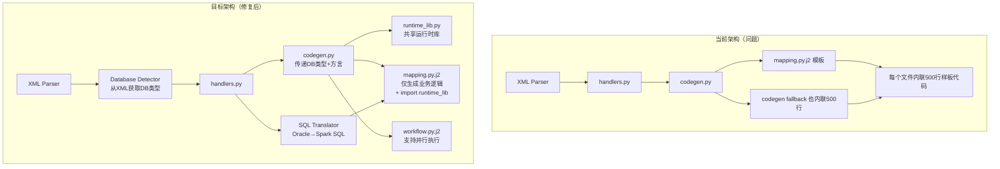

# Informatica-Sparker 根源分析与修复方案

## 问题 1: 为什么生成的是 MSSQL 代码而非 Oracle？

### 根源追踪

| 文件 | 行 | 问题代码 | 影响 |
|------|---|---------|------|
| `models.py` | 12-17 | `CONNECTION_TO_DATABASE_MAP` 硬编码 | 强制将 XML 中的连接名映射到 MSSQL 数据库 |
| `mapping.py.j2` 模板 | 85-150 | 始终生成 `jdbc:sqlserver://` JDBC URL | 所有 mapping 文件都连接 MSSQL |
| `codegen.py` | `_generate_mapping_fallback` | 硬编码 `read_mssql_query()` / `write_mssql_target()` | fallback 路径也输出 MSSQL |
| `mapping.py.j2` 模板 | 160-180 | 写死 `com.microsoft.sqlserver.jdbc.SQLServerDriver` | 无论 XML 中 DB 类型如何 |

### 根本原因

`informatica-sparker` 是从一个特定项目（PCIS_GMS）的转换需求中提取出来的工具。代码中残留了大量针对该项目的**硬编码假设**：

1. **`models.py` 第 12-17 行** — `CONNECTION_TO_DATABASE_MAP` 将 CDM_PRE_LANDING 等连接名强制映射到 MSSQL 的 msscdm_dev，对其他项目完全无用
2. **`mapping.py.j2` 模板** — 整个连接设置部分（约 100 行）硬编码了 MSSQL 驱动和 JDBC URL
3. **`codegen.py` 第 200-270 行** — `_generate_mapping_fallback` 方法也硬编码了 MSSQL 的读取和写入函数
4. **`codegen.py` 第 95-120 行** — `_generate_step_code_v2` 中的 `READ_SQL` 处理器写死了 `read_mssql_query` 和 `read_mssql_lkp_query`

### 修复方案

#### 方案 A: 让模板根据 XML 元数据动态生成连接代码（推荐）

**需要修改的文件**:
1. **`models.py`** — 删除硬编码的 `CONNECTION_TO_DATABASE_MAP`，改为从 XML 解析的数据库类型生成
2. **`codegen.py`** — 修改 `generate()` 方法，将数据库类型信息传递给模板
3. **`mapping.py.j2`** — 根据传入的数据库类型动态生成连接代码
4. **`codegen.py` `_generate_step_code_v2`** — 动态选择 read/write 函数

**具体改动**:

**models.py**: 删除硬编码映射
```python
# 删除这些行（约第 12-19 行）
# CONNECTION_TO_DATABASE_MAP = {
#     "CDM_PRE_LANDING": "msscdm_dev",
#     ...
# }
```

**codegen.py**: 在 `generate()` 中传递源数据库信息
```python
def generate(self, plan: IRPlan, user_config: UserConfig) -> List[GeneratedFile]:
    # 从 plan 或 parser 获取源数据库类型
    source_db_type = plan.source_db_type or "oracle"  # 从 XML 解析
    target_db_type = plan.target_db_type or "oracle"
    
    template = self.env.get_template("mapping.py.j2")
    return template.render(
        mapping_name=plan.mapping_name,
        source_db_type=source_db_type,  # 新增
        target_db_type=target_db_type,  # 新增
        ...
    )
```

**mapping.py.j2**: 动态生成连接代码
```jinja2
{# 根据数据库类型动态选择 JDBC 驱动 #}










```

#### 方案 B: 增加 --db-type 命令行参数

在 `cli.py` 中添加参数，用户指定源数据库和目标数据库类型：
```python
# cli.py
@click.option('--source-db', default='oracle', help='Source database type')
@click.option('--target-db', default='oracle', help='Target database type')
```

---

## 问题 2: 为什么有大量重复的样板代码？

### 根源追踪

每个生成的 mapping Python 文件都包含约 **500 行**完全相同的代码：
- 配置加载（`resolve_env_vars`, `load_config`）
- 连接设置（`CONNECTION_DB_MAPPING`, JDBC URLs）
- Spark Session 初始化
- SparkContext 类
- MappingMetrics 类
- I/O 函数（`read_source`, `read_lookup`, `write_target`, `safe_write_jdbc`）
- Delta Lake 函数（`merge_into_delta`）
- 表达式辅助函数（`infa_iif`, `infa_decode`, `infa_nvl`）
- 列名标准化函数（`normalize_column_names`, `safe_col`）

### 根本原因

**`mapping.py.j2` 模板将所有代码内联（inline）到每个文件**，而不是使用共享库导入。虽然 `templates/lib/` 目录下存在共享库模板文件（`io.py.j2`, `expressions.py.j2`, `spark.py.j2`, `logging.py.j2`, `delta.py.j2`），但**主模板从未引用它们**。

### 修复方案

#### 方案 A: 提取共享运行时库（推荐）

将通用代码提取到共享 Python 包中，每个 mapping 文件只生成 import 语句：

1. **生成一个 `runtime_lib.py` 文件**（已有模板 `runtime_lib.py.j2` 但未使用）

2. **修改 `mapping.py.j2`**，开头改为：
```jinja2
from runtime_lib import (
    SparkContext, MappingMetrics, 
    read_source, read_lookup, write_target,
    normalize_column_names, safe_col,
    infa_iif, infa_decode, infa_nvl,
    smart_repartition, safe_write_jdbc
)
```

3. **在 `service.py` 中**，确保 `runtime_lib.py` 作为共享文件生成一次：
```python
# 只生成一次 runtime_lib
if not any(f.filename == 'runtime_lib.py' for f in all_files):
    runtime_content = self._generate_runtime_lib(source_db_type, target_db_type)
    all_files.append(GeneratedFile(filename='runtime_lib.py', content=runtime_content))
```

**效果**: 每个 mapping 文件从 ~800 行减少到 ~100 行，且修改共享逻辑只需改一个文件。

---

## 问题 3: Oracle SQL 方言如何推送到 MSSQL？

### 根源追踪

在 `handlers.py` 的 `_handle_source_qualifier()` 方法中（约第 360-380 行）：

```python
final_sql = sql_override.strip() if sql_override.strip() else sql_query.strip()
use_sql_pushdown = bool(final_sql)

if use_sql_pushdown:
    # ... 直接使用 Oracle SQL 作为 pushdown
    step.params["sql_query"] = final_sql  # 未经翻译
```

然后在 `codegen.py` 中（`_generate_step_code_v2`, `APPLY_SOURCE_QUALIFIER` 分支）：
```python
if use_sql_override and sql_query:
    lines.append(f'{step.df_output} = read_mssql_query("""')
    lines.append(f'{sql_query.strip()}')  # Oracle SQL 直接被发送到 MSSQL
```

### 为什么 Oracle SQL 无法在 MSSQL 上运行

这条 SQL 包含了 Oracle 专有语法：
| Oracle 语法 | MSSQL 替代 |
|------------|-----------|
| `to_date($$v_snsh_date,'yyyyMMdd')` | `CONVERT(DATE, $$v_snsh_date, 112)` |
| `add_months(date, -20*12)` | `DATEADD(MONTH, -20*12, date)` |
| `sysdate` | `GETDATE()` |
| `nvl(a, 0)` | `ISNULL(a, 0)` |
| `trunc(date)` | `CAST(date AS DATE)` |
| `table1, table2` (隐式连接) | `table1 CROSS JOIN table2` 或 `INNER JOIN` |
| `a.col = b.col (+)` (外连接) | `a.col = b.col` + 正确 JOIN 类型 |

### 修复方案

**方案 A: 内部 SQL 翻译引擎（推荐）**

在 `expr_translator.py` 中添加 Oracle → 目标数据库的 SQL 翻译功能：

```python
class OracleToSparkSQLTranslator:
    """将 Oracle SQL 翻译为 Spark SQL / 目标数据库 SQL"""
    
    ORACLE_TO_SPARK = {
        r"\bto_date\(([^,]+),'([^']+)'\)": "TO_DATE({1}, {2})",  # Spark 3.x+
        r"\bsysdate\b": "CURRENT_DATE",
        r"\bsystimestamp\b": "CURRENT_TIMESTAMP",
        r"\bnvl\(([^,]+),([^)]+)\)": "COALESCE({1}, {2})",
        r"\btrunc\(([^)]+)\)": "CAST({1} AS DATE)",
        r"\badd_months\(([^,]+),([^)]+)\)": "ADD_MONTHS({1}, {2})",
        r"\(([^)]+)\s*\(\+\)": "{1}",  # Remove Oracle outer join (+)
    }
```

**方案 B: 禁用 SQL Pushdown，自动转为 DataFrame API**

对于复杂 SQL，可先执行 SQL pushdown 到 Oracle（源数据库），获取结果后再在 Spark 中处理。这需要工具支持多数据库连接。

**方案 C: --sql-dialect 参数**

让用户指定输出 SQL 的方言类型：

```python
# cli.py
@click.option('--sql-dialect', default='spark', 
              type=click.Choice(['spark', 'oracle', 'sqlserver', 'ansi']))
```

---

## 问题 4: Update Strategy (DD_DELETE/DD_UPDATE) 未正确实现

### 根源追踪

`handlers.py` 约第 1030-1060 行：
```python
def _handle_update_strategy(self, instance, plan):
    strategy_expr = transform.table_attributes.get("Update Strategy Expression", "DD_INSERT")
    has_update = "DD_UPDATE" in strategy_expr.upper()
    has_delete = "DD_DELETE" in strategy_expr.upper()
    
    step.params["has_update"] = has_update
    step.params["has_delete"] = has_delete
    step.params["needs_merge"] = has_update or has_delete
    
    if has_update or has_delete:
        step.comments.append("Consider using MergeDelta for upsert operations")
    # 只是添加注释，没有实际实现！
```

在 `codegen.py` 中，`APPLY_UPDATE_STRATEGY` 没有被 `_generate_step_code_v2` 处理，fallback 到:
```python
else:
    lines.append(f'# {step.step_type.name}: {step.step_name}')
    lines.append(f'{step.df_output} = {step.df_input}')
```
所以 Update Strategy 被忽略了。

而在 `mapping.py.j2` 模板中也没有专门的 `APPLY_UPDATE_STRATEGY` 处理逻辑。

### 修复方案

在 `codegen.py` 中添加 Update Strategy 处理：

```python
elif step.step_type == IRStepType.APPLY_UPDATE_STRATEGY:
    strategy = step.params.get("strategy_expression", "DD_INSERT")
    has_delete = step.params.get("has_delete", False)
    has_update = step.params.get("has_update", False)
    
    lines.append(f'# Update Strategy Transformation - {step.step_name}')
    lines.append(f'# Strategy: {strategy}')
    lines.append('')
    
    if has_delete:
        # DD_DELETE: 标记删除行
        lines.append(f'{step.df_output} = {step.df_input}.withColumn("_update_flag", lit("D"))')
    elif has_update:
        # DD_UPDATE: 标记更新行
        lines.append(f'{step.df_output} = {step.df_input}.withColumn("_update_flag", lit("U"))')
    else:
        # DD_INSERT (默认): 标记插入
        lines.append(f'{step.df_output} = {step.df_input}.withColumn("_update_flag", lit("I"))')
    
    # 对目标表执行 merge/delete+insert
    if has_delete:
        lines.append(f'# DD_DELETE: Delete existing records for this snapshot date')
        lines.append(f'execute_pre_sql("DELETE FROM {{target_table}} WHERE time_dmns_key = (SELECT time_dmns_key FROM dds_dmns_time WHERE time_val_date = CAST(\\'{{snapshot_date}}\\' AS DATE))")')
```

---

## 问题 5: `$$v_snsh_date` 参数未处理

### 根源追踪

`expr_translator.py` 中 `_replace_pm_variables`（约第 430 行）只处理 `$PM` 开头的变量：
```python
remaining_pm = re.findall(r'\$PM[A-Za-z_][A-Za-z0-9_]*', result)
```

而 Informatica 映射变量使用 `$$` 前缀（如 `$$v_snsh_date`），未被识别和替换。

### 修复方案

在 `_replace_pm_variables` 中添加 `$$` 变量处理：

```python
def _replace_pm_variables(self, expr: str) -> str:
    # ... existing code ...
    
    # 新增: 处理 $$ 映射变量
    remaining_dollar = re.findall(r'\$\$[A-Za-z_][A-Za-z0-9_]*', result)
    for var_name in remaining_dollar:
        var_value = self.pm_variables.get(var_name, "")
        if var_value:
            safe_value = str(var_value).replace("'", "''")
            result = result.replace(var_name, f"'{safe_value}'")
        else:
            # 保留为参数占位符，但改为 Spark SQL 兼容格式
            safe_var = var_name.replace("$", "").replace("'", "''")
            result = result.replace(var_name, f"${{{{_{safe_var}_}}}}")
    
    return result
```

---

## 问题 6: 其他次要问题

### 6.1 数据库 Schema/Owner 未映射

原始 XML 中表名附带 Owner（如 `PDDS.DDS_FACT_GMS_DLY_MSD_SMRY`），但生成的 PySpark 代码中使用的表名不带 Schema。

**修复**: 在 `_handle_target` 和 `_handle_source` 中使用 `{owner}.{table_name}` 格式。

### 6.2 并行执行变串行执行

原始 Worklet 中 3 个 Session 可以并行运行。生成的 workflow.py 顺序执行。

**修复**: 在 `workflow_orchestration.py.j2` 中添加并行执行支持：
```python
from concurrent.futures import ThreadPoolExecutor, as_completed

with ThreadPoolExecutor(max_workers=3) as executor:
    futures = {
        executor.submit(run_mapping_a): "MAP_A",
        executor.submit(run_mapping_b): "MAP_B",
        executor.submit(run_mapping_c): "MAP_C",
    }
    for future in as_completed(futures):
        name = futures[future]
        try:
            future.result()
            logger.info(f"{name} completed")
        except Exception as e:
            logger.error(f"{name} failed: {e}")
```

### 6.3 生成的 config.yml 中连接名固定

`config.yml` 总是假设 CDM_PRE_LANDING 等连接，不反映 XML 中实际使用的连接。

**修复**: 根据 XML 解析结果动态生成 config.yml 的连接部分。

---

## 修复优先级总结

| 优先级 | 问题 | 文件 | 影响 |
|--------|------|------|------|
| 🔴 P0 | MSSQL 硬编码 | `mapping.py.j2`, `codegen.py`, `models.py` | 生成的代码无法运行 |
| 🔴 P0 | Oracle SQL → MSSQL pushdown | `codegen.py`, `handlers.py` | SQL 执行失败 |
| 🔴 P0 | `$$v_snsh_date` 未处理 | `expr_translator.py` | 参数未替换 |
| 🟡 P1 | Update Strategy 未实现 | `codegen.py`, `handlers.py` | 增量逻辑缺失 |
| 🟡 P1 | 大量重复代码 | `mapping.py.j2`, `codegen.py` | 难以维护 |
| 🟢 P2 | Schema/Owner 未映射 | `handlers.py` | 表名可能找不到 |
| 🟢 P2 | 并行→串行 | `workflow_orchestration.py.j2` | 性能降低 |
| 🟢 P2 | config.yml 连接固定 | `service.py` | 需要手动修改 |

---

## 推荐的整体架构改进


